# Clonezilla Remote Samba

---

## 2. Preparativos

### 2.1. MV1: Windows7

* Añadir un segundo disco de `100MB`
* Asignarle la letra `E:`
* Formatearlo en NTFS
* Grabar en él lo siguiente:
  * Fichero de texto `file1-24`
  * Imagen `file2-24`
  * Canción `file3-24`

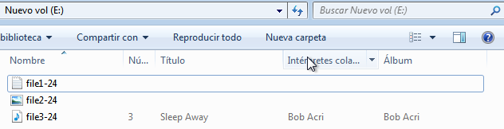

### 2.2. MV2: Windows 2008 Server

*  Añadir un segundo disco de `1GB`
* Asignarle la letra `E:`
* Formatearlo en NTFS

**Carpeta para compartir**

Crear una carpeta llamada `samba24`

> Lectura/escritura para el usuario jorge

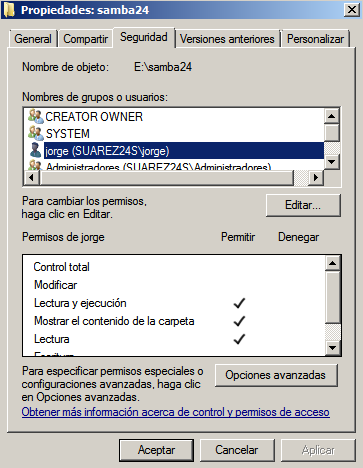

**Recurso compartido:**

* Compartir la carpeta

> Lectura/escritura para el usuario jorge

* Uso compartido avanzado
* Poner `imagenes24` como nombre del recurso compartido

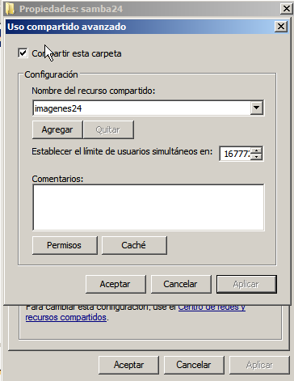

### 2.3. Comprobar el recurso de red

Para comprobar el recurso de red, acedemos al recurso compartido desde Windows7 y creamos un fichero de texto. Si no se pudiera mirar los permisos.

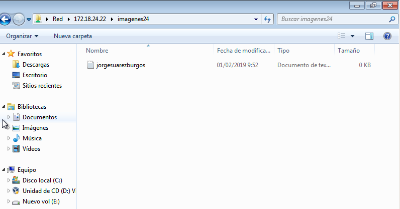

---

## 3. Clonación

**Realizar clonación**

* La hacemos tipo `device-image`

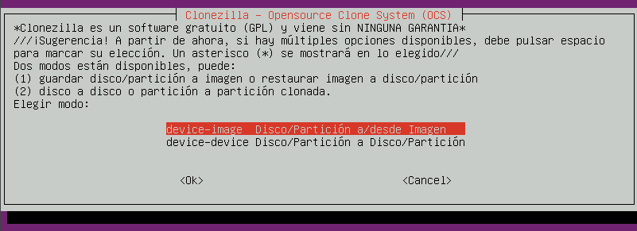

* Elegimos `samba_server` como repositorio de almacenamiento utilizando clave/usuario del *Windows Server*.

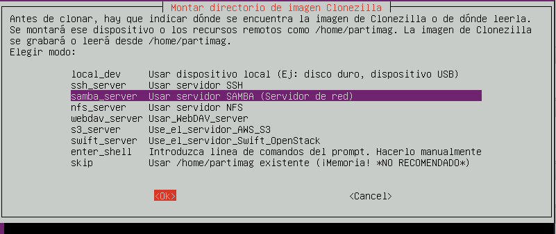

* Configuramos la tarjeta de red en modo *DHCP*

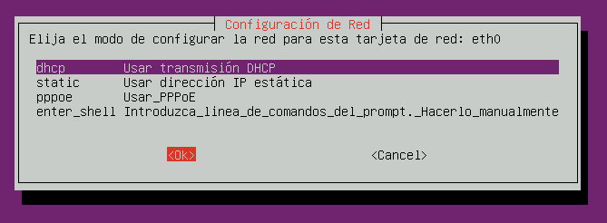

* Modo `Begginer`

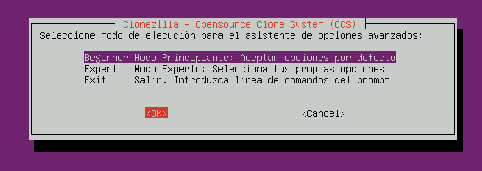

* Para guardar las particiones, utilizar `saveparts`.

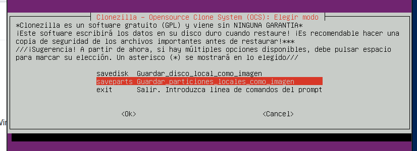

* Elegir grabar solo el disco 2

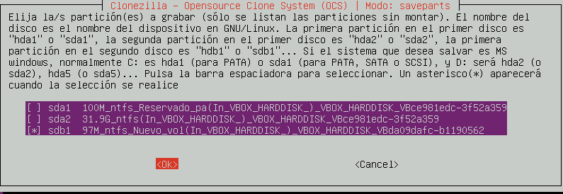

**Comprobar que hay fichero de imagen en el servidor**

Consultamos el directorio `E:\samba24\` del servidor, debe estar la imagen de clonación hecha con clonezilla.

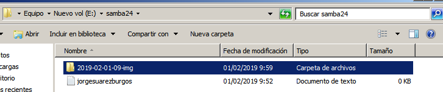

---

## 4. Restauración

Ahora vamos a restaurar.

* Iniciamos MV Windows7

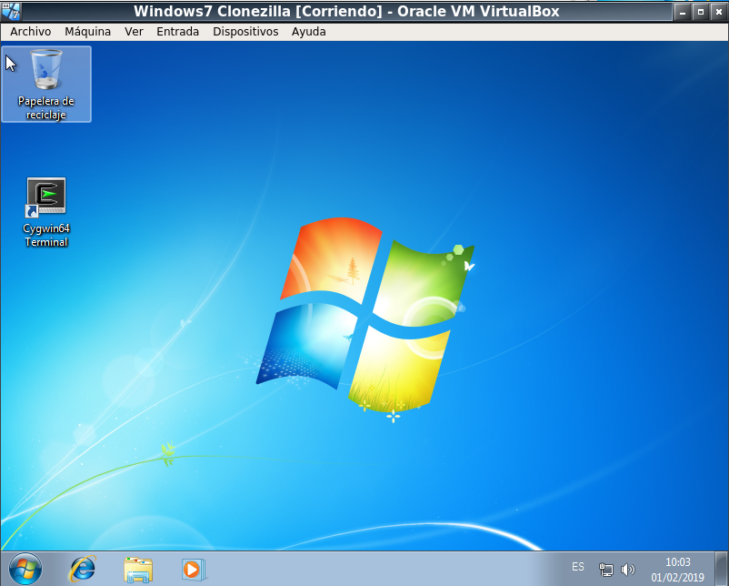

* Eliminamos los ficheros del Windows7 (`file1-24`, `file2-24` y `file3-24`)

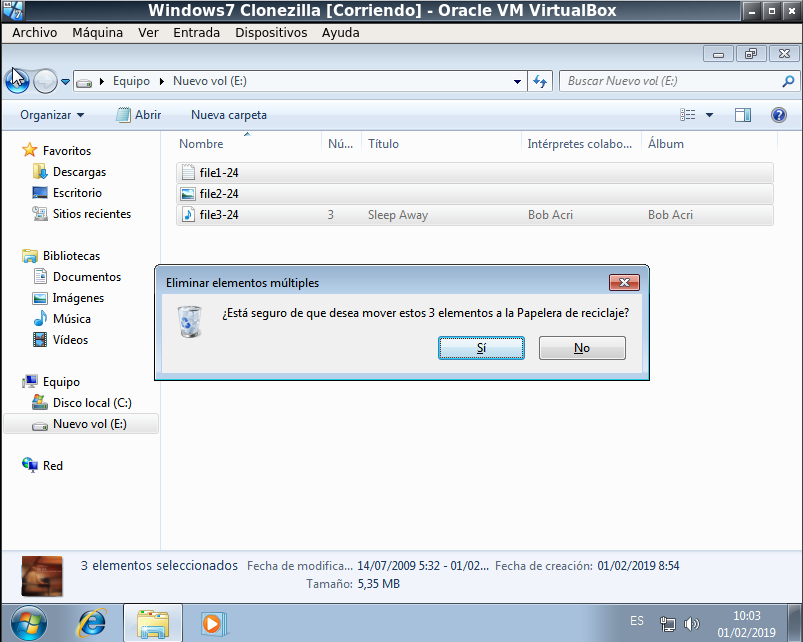

* Iniciar con Clonezilla

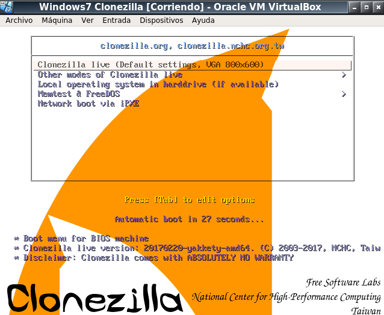

* Utilizamos `restoreparts`

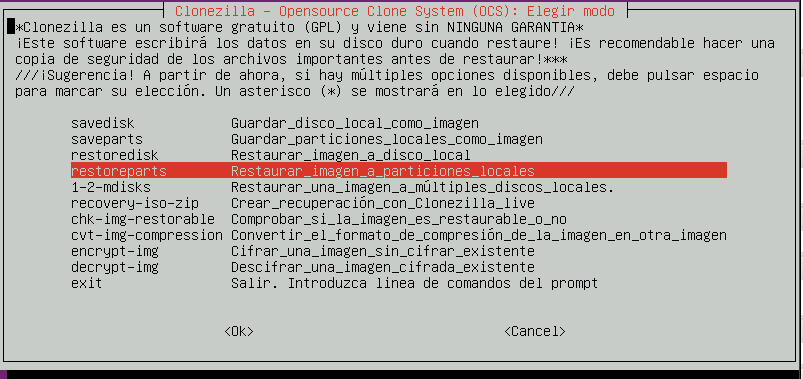

* Elegimos la imagen que restaurar y luego en que disco restaurarlo.

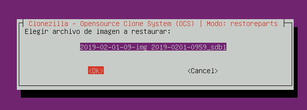

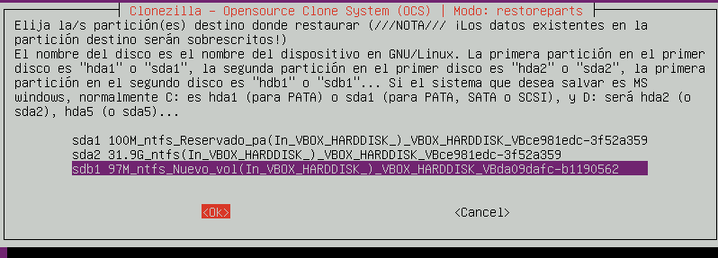

* Comprobamos que se ha restaurado correctamente.

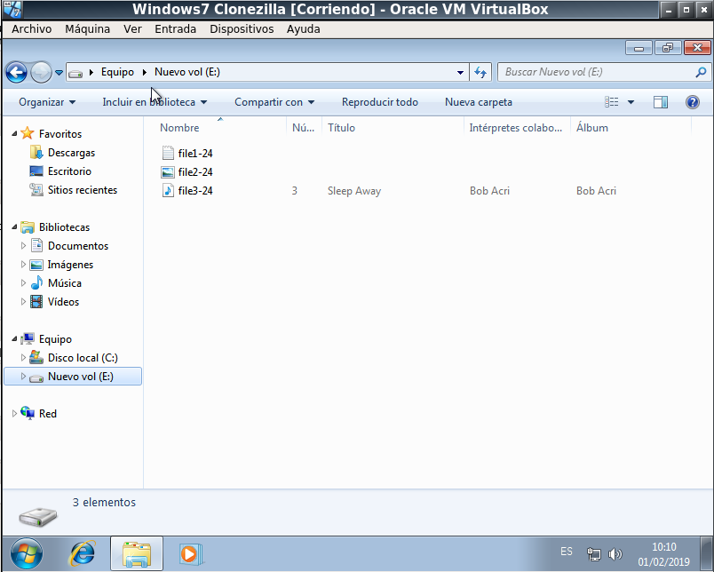
