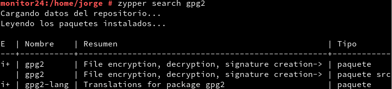
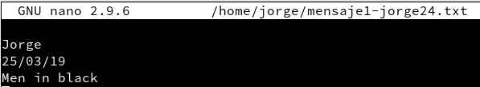

# Ocultación de la información

---

## Encriptación

### 1.1. Encriptado simétrico

* Antes que nada, nos aseguramos tener instalado GPG

* Creamos un fichero de texto llamado `/home/jorge/mensaje1-jorge24.txt`.
  * Escribimos dentro nuestro nombre, fecha de hoy y el título de una película.

* Tras esto, hacemos una encriptación simétrica con GPG.

### 1.2. Encriptado asimétrico

**Alumno1**

**Alumno2**

**Alumno1**

## 2. Firma

---

## 3. Esteganografía

---

## 4. Contenedor encriptado
