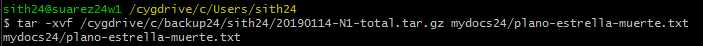

# Copias de Seguridad

---

## 1. Backup: Entorno Gráfico GNU/Linux

### 1.1. El usuario tiene datos para guardar

### 1.2. Preparamos la copia de seguridad

### 1.3. Realizar la copiade seguridad

---

## 2. Backup: Entorno gráfico Windows

### 2.1. En el Windows Server

### 2.2. En el Windows7

---

## 3. Backup: Comandos en GNU/Linux

### 3.1. El usuario tiene datos

### 3.2. Preparamos la copia de seguridad

### 3.4. Realizamos la copia de seguridad

---

## 4. Backup: Comandos Windows

### 4.1. El usuario tiene datos que guardar

