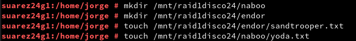
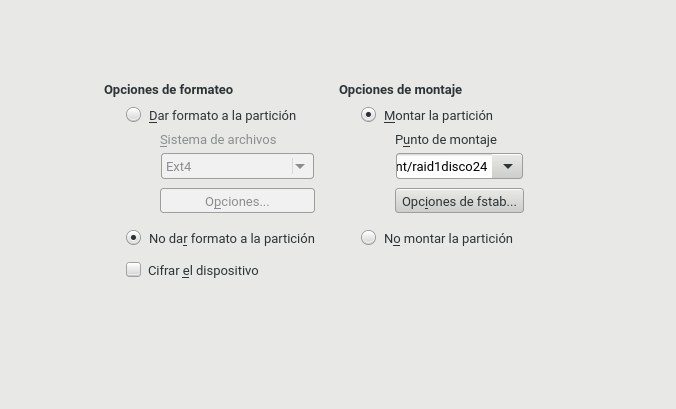
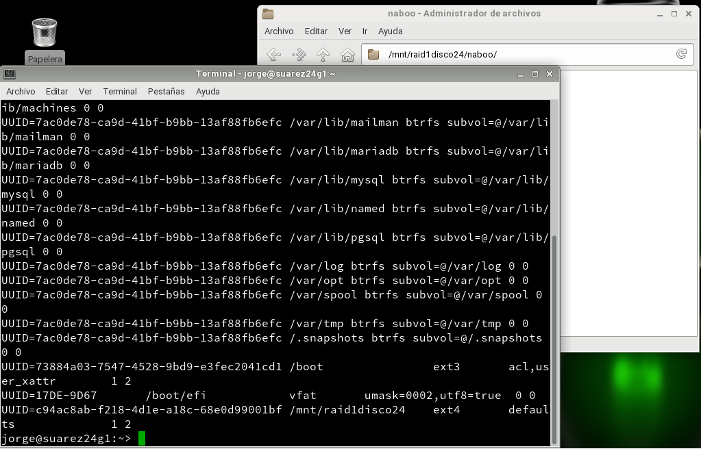
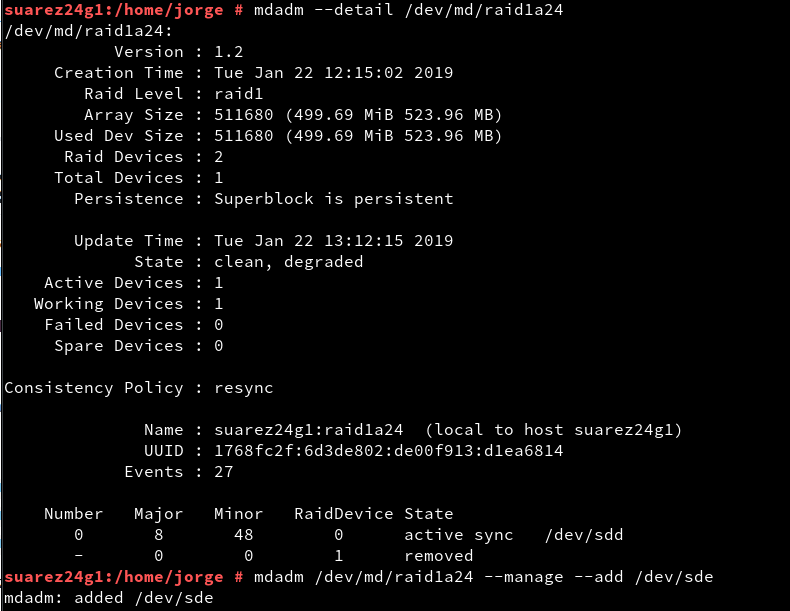
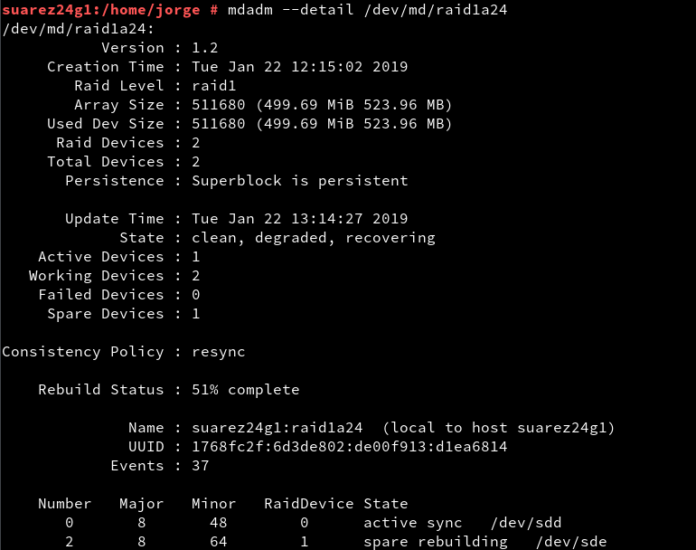

# Raid OpenSUSE y Windows

---

## 1. Instalar OpenSUSE en disco RAID0 software

## 1.1. Creación de la MV

Crear una máquina virtual con 3  discos vituales SATA:
* `(a) 200MB`
* `(b) 10GB`
* `(c) 10GB`

### 1.2. Particionado e instalación

Empezar el proceso de instalación
Elegir particionado experto y crear las siguientes particiones:

Dispositivo | Tamaño | Tipo | Formato | Montar
----------- | ------ | ---- | ------- | ------
/dev/sda1 | 150MB | Partición | ext3 | /boot
/dev/sda2 | 50MB | Partición | fat32 | /boot/efi
/dev/sdb1 | 10GB | Partición | RAID |
/dev/sdc1 | 10GB | Partición | RAID |

Creamos el nuevo volumen RAID-0 con `sdb1` y `sdc1`

Dispositivo | Tamaño | Tipo | Formato | Montar
----------- | ------ | ---- | ------- | ------
/dev/md/raid0a24 | 20GB | Partición | btrfs | /

### 1.3. Comprobación

Tras realizar las particiones y el RAID-0, lo comprobamos con los siguientes comandos:
* `date`
* `hostname`
* `ip a`
* `ip route`
* `host www.nba.com`
* `fdisk -l`
* `df -hT`
* `cat /proc/mdstat`
* `lsblk -fm`

---

## 2. RAID-1 software

Para prevenir algún contratiempo, haremos una instantánea de la MV.

### 2.1. Preparar la MV

Ahora añadiremos 2 discos virtuales del mismo tamaño:
* `(d) 500MB`
* `(e) 500MB`

Para comprobar que son `/dev/sdd` y `/dev/sde` utilicé el comando `fdisk -l`.

### 2.2. Crear RAID-1

Creamos un RAID-1 con los discos `(d)` y `(e)` llamado `/dev/md/raid1a24`.

Lo creamos en formato `ext4`.

### 2.3. Comprobar RAID-1

Tras crearlo utilizaremos varios comandos para comprobar que se ha creado correctamente:
* `cat /proc/mdstat`
* `lsblk -fm`
* `mdadm --detail /dev/md/raid1a24`

### 2.4. Escribir datos en el RAID-1

Tras comprobar que se creó correctamente, montamos el dispositivo en `raid1disco24` con el comando:
> `mount /dev/md/raid1a24 /mnt/raid1disco24`

Comprobamos que se montó bien con `df -hT`.

Tras montarlo, creamos los siguientes ficheros/directorios:
* Directorio `/mnt/raid1disco24/naboo`
* Fichero `/mnt/raid1disco24/naboo/yoda.txt`
* Directorio `/mnt/raid1disco24/endor`
* Fichero `/mnt/raid1disco24/endor/sandtrooper.txt`

### 2.5. Configuración de RAID-1

Antes que nada, volvemos a hacer una snapshot de la MV por seguridad.

Hacemos la configuración de RAID1 permanente por `Yast`.

### 2.6. Montaje automático

Ahora configuramos el fichero `/etc/fstab` para que el disco raid1a24 se monte automáticamente en cada reinicio.

* Hacemos una copia del fichero
* Ir a `Yast -> Particionador`
* Configurar para que el disco `/dev/md/raid1a24` se monte automáticamente en cada reinicio en `/mnt/raid1disco24`.
* Para finalizar consulté el fichero `/etc/fstab` resultante.

---

## 3. Quitar disco y probar

Apagamos la máquina y quitamos el disco `/dev/sde`.
Reiniciamos y comprobamos que la información no se ha perdido.
Volvemos a poner el disco y reiniciamos.

Tras esto, sincronizamos los discos y comprobamos que esta correcto con los siguientes comandos:
* `mdadm --detal /dev/raid1a24`
* `mdadm /dev/raid1a24 --manage --add /dev/sde`
* `mdadm --detal /dev/raid1a24`

Tras esto, comprobamos que esta todo correcto con los siguientes comandos:
* `date`
* `fdisk -l`
* `df -hT`
* `cat /proc/mdstat`
* `lsblk -fm`
* `cat /etc/mdadm.conf`

