# Volúmenes Lógicos: Debian + Windows

---

## 1. Instalar SO sobre LVM

### 1.1. Preparar MV

Creamos una MV Debian con:
* Disco de 8GB
* Red en `modo puente`
* Una vez llegado al particionado, parar y realizar de la siguiente forma manualmente.

### 1.2. Particionar

**Partición BOOT**

Partición | Tamaño | Formato | Montaje
--------- | ------ | ------- | -------
Primaria | 100MB | ext2 | /boot

**Partición para LVM**

Crearemos una partición lógica, de tipo `LVM` con todo lo que nos queda de espacio en disco.
Crearemos un Grupo de Volumen llamado `vg24debian`.

Volumen Lógico | Tamaño | Formato | Montaje
--------- | ------ | ------- | -------
lv24swap | 500MB | swap | intercambio
lv24raiz | 5GB | ext4 | /
lv24datos | 100MB | ext3 | /home

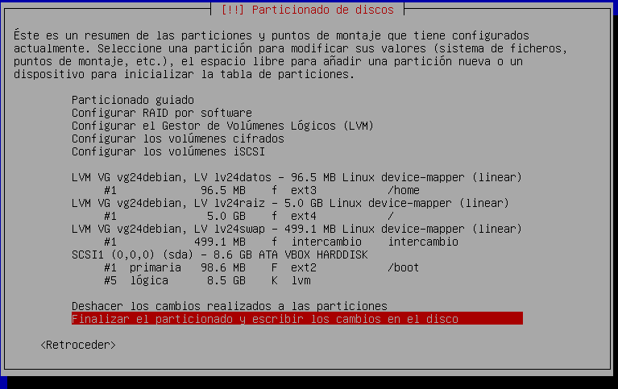

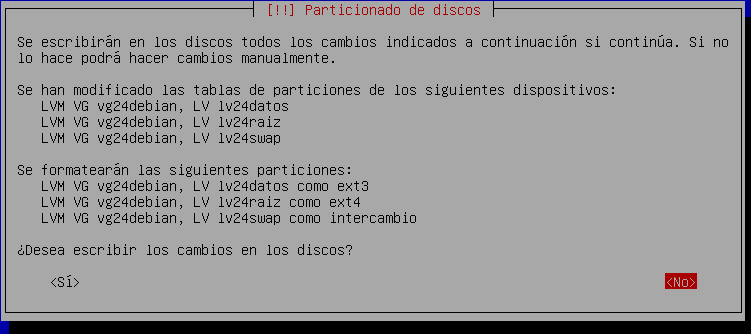

Tras particionar, terminamos la instalación y la configuración del sistema operativo.

### 1.3. Comprobación de la instalación LVM

Reiniciamos el sistema y comprobamos que lo tenemos bien con los siguientes comandos:
* `date`
* `hostname -f`
* `ip a`

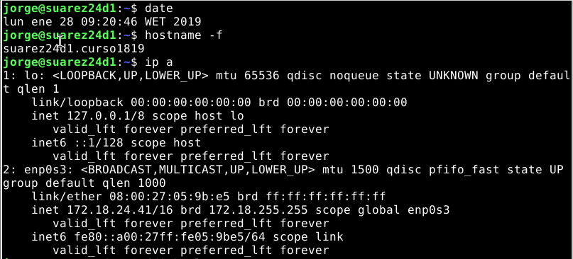

* `fdisk -l`

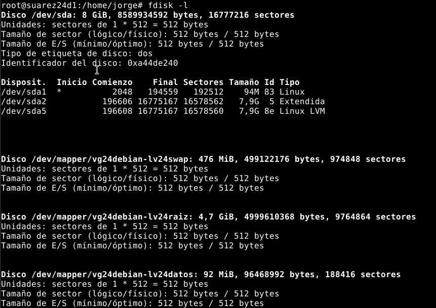

* `vgdisplay`

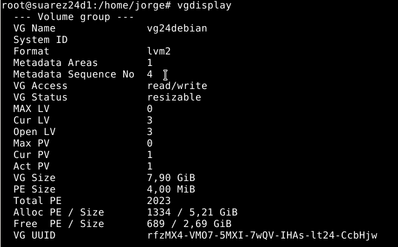

* `lvdisplay vg24debian`

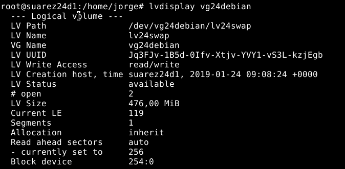

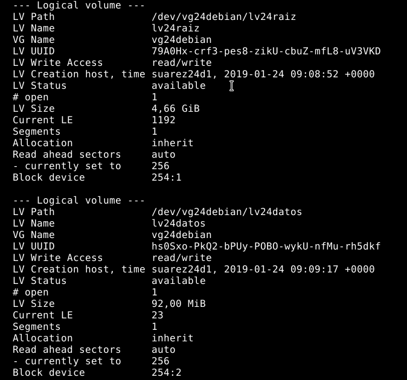

---

## 2. Aumentar el tamaño del VL en caliente

Ahora, ampliaremos el espacio de `lv24datos` de 100MB a 400MB.

### 2.1. Ampliamos

Para empezar consultamos el tamaño actual del volumen lógico con:
`lvdisplay -v /dev/vg24debian/lv24datos`

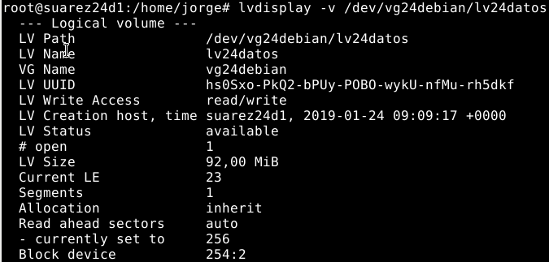

Luego ampliamos el tamaño del volumen lógico con:
`lvextend --resizefs -L 400 /dev/vg24debian/lv24datos`

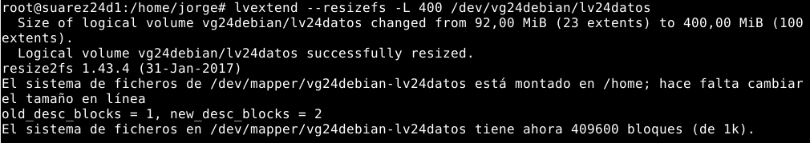

Después, consultamos el tamaño actual con el primer comando.

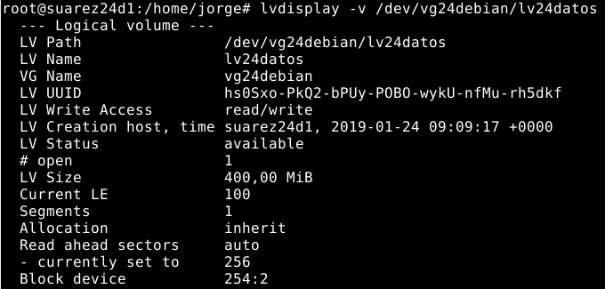

### 2.2. Comprobamos

Ahora, comprobamos que hemos aumentado correctamente el tamaño de `lv24datos` con los siguientes comandos:
* `vgdisplay`

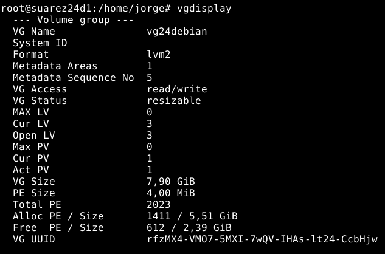

* `lvdisplay vg24debian`

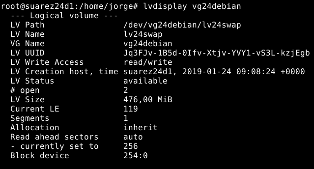

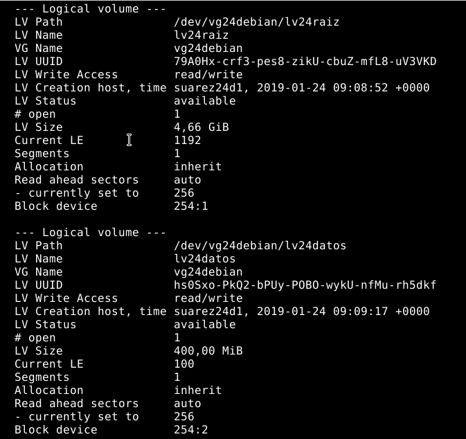

* `df -hT`

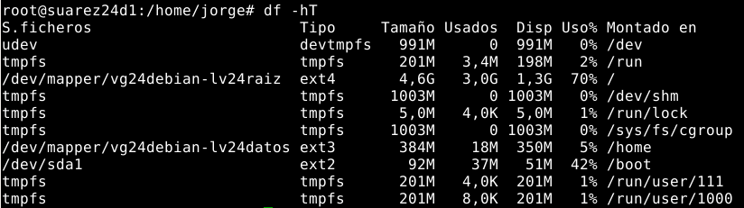

---

## 3. Modificar el espacio físico LVM

Antes que nada hacer una snapshot de la MV por si acaso.

### 3.1. Preparar la MV

Añadimos dos discos virtuales:
  * Disco *B* de `200MB`: con una partición completa del disco.
  * Disco *C* de `750MB`: con 3 particiones de 250MB sin formato, ni tipo.

Yo creé las particiones con el programa `gparted`.

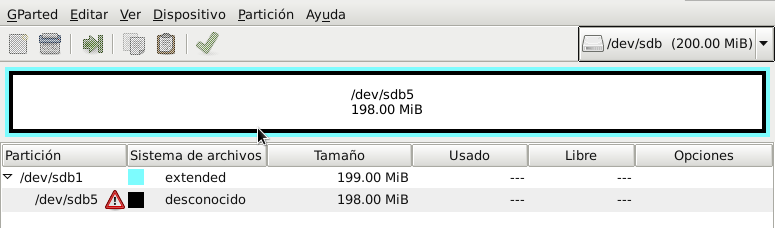

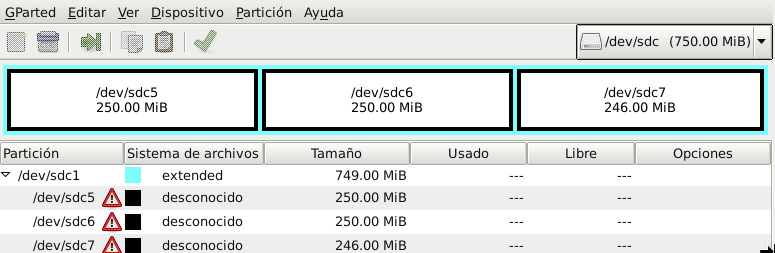

### 3.2. Crear VG y VL

Crearemos un grupo de volumen llamado `vg24extra` con el disco *(B)* y las 2 primeras particiones del disco *(C)*.
Utilizaremos el siguiente comando:
`vgcreate /dev/vg24extra /dev/sdb5 /dev/sdc5 /dev/sdc6`

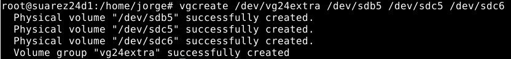

Creamos un nuevo Volumen Lógico llamado `lv24extra` con tamaño 690MB.
El comando es `lvcreate -L690M -n lv24extra vg24extra`.

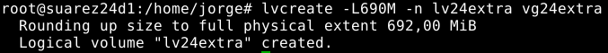

Comprobamos que todo se ha creado correctamente con los comandos:

* `vgdisplay vg24extra`

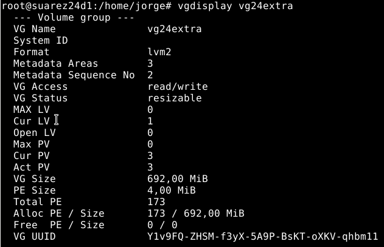

* `lvdisplay vg24extra`

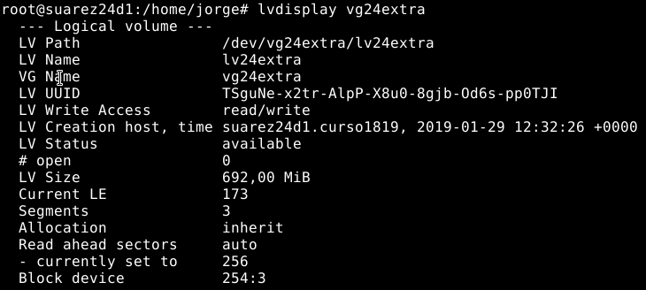

### 3.3. Escribir información

Vamos a darle formato `ext4` al nuevo dispositivo.
> `/dev/vg24extra/lv24extra`

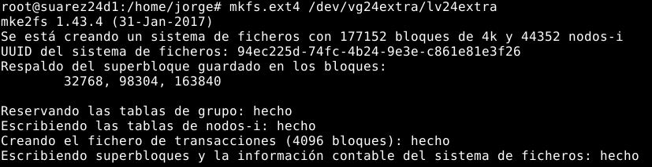

Tras esto, crear un directorio, en este caso `/mnt/vol24extra` y montamos `lv24extra`.

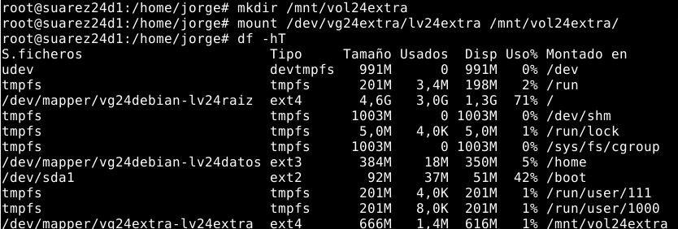

Comprobamos que se ha montado correctamente.

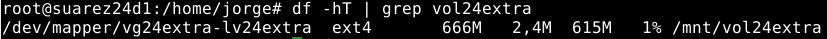

### 3.4. Añadir más tamaño

Añadimos la tercera partición del disco *(C)* al VG con los siguientes comandos:

* `pvcreate /dev/sdc7`
* `vgextend vg24extra /dev/sdc7`
* `vgdisplay vg24extra`

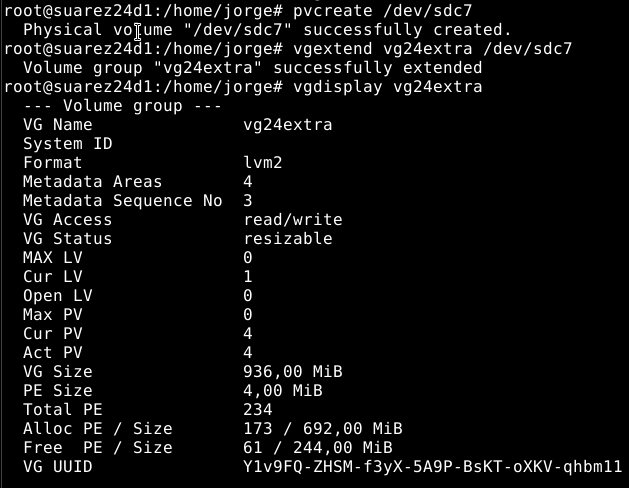

### 3.5. Quitar un disco físico del VG

Ahora dejaremos de utilizar el disco *(C)*, para ello primeramente tenemos que seguir unos pasos:
  * Primero comprobamos que el tamaño utilizado por nuestros datos sea inferior a 50MB con `du -sh /mnt/vol24extra`.

  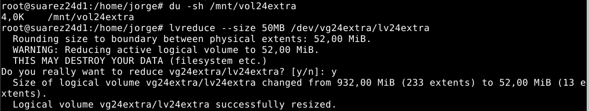

  * Si no fuera así, utilizamos el comando `lvreduce --size 50MB /dev/vg24extra/lv24extra` para reducir el tamaño del volumen lógico `lv24extra`.
  * Comprobamos con `lvdisplay /dev/vg24extra/lv24extra`

Antes de quitar el disco *(C)*, debemos asegurarnos de que no almacena datos.
* Primero movemos la informacion del disco `sdc` al disco `sdb`:
  * `pvmove /dev/sdc5 /dev/sdb5`
  * `pvmove /dev/sdc6 /dev/sdb5`
  * `pvmove /dev/sdc7 /dev/sdb5`

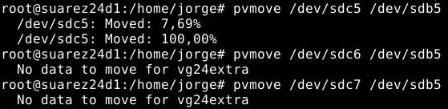

* Ahora reducimos el tamaño del grupo de volumen:
  * `vgreduce vg24extra /dev/sdc5`
  * `vgreduce vg24extra /dev/sdc6`
  * `vgreduce vg24extra /dev/sdc7`

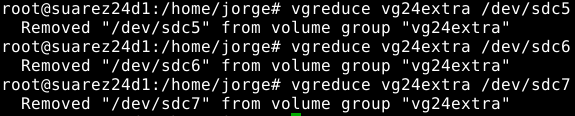

### 3.6. Comprobamos

Para finalizar, comprobamos lo que tenemos:

* `vgdisplay vg24extra`

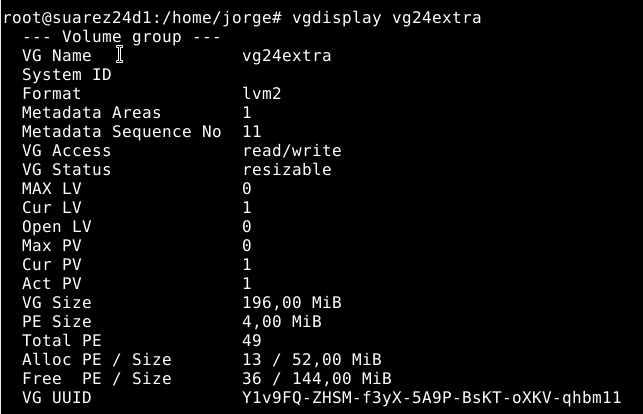

* `lvdisplay vg24extra`

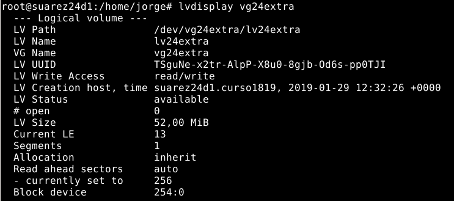
