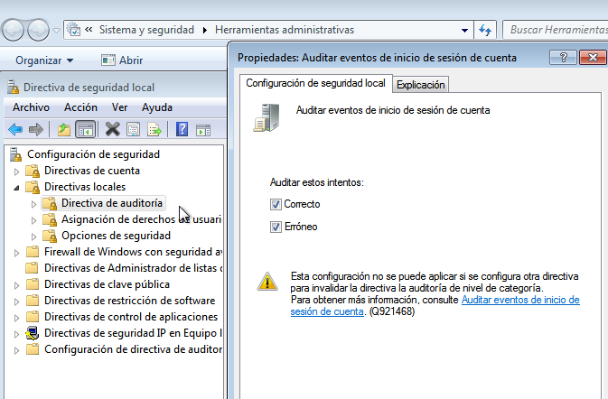
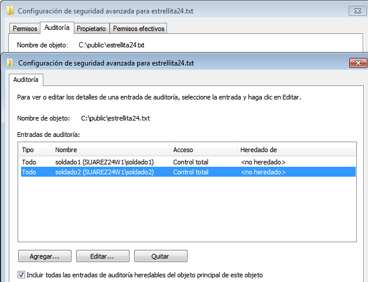

# Eventos locales (Windows, OpenSUSE y audit)

---

## 1. Introducción

La actividad importante se queda registrada en los ficheros de registro. Esto nos permite tener un histórico del comportamiento del sistema que nos ayuda a reconstruir situaciones del pasado para diversos fines.

---

## 2. SO Windows

### 2.1. Auditar inicios de sesión

Ir a `Directiva de seguridad local` dentro de `Herramientas administrativas`, y activar la opción para directivas de seguridad, `Auditar eventos de inicio de sesión de cuenta`.

Crear el archivo `C:\public\estrellita24.txt`

En el apartado de `Seguridad` del fichero, entrar en `Opciones avanzadas` y luego en `Auditoría`. Habilitar configuración de correctos y erróneos par `soldado1` y `soldado2`

### 2.2 Auditar acceso a un fichero

---

## 3. GNU/Linux OpenSUSE

### 3.1. Un poco de teoría

### 3.2. Instalación y teoría

### 3.3. Crear una regla temporal para auditar un fichero

### 3.4. Empezamos a generar eventos

### 3.5. Hacer un informe con los eventos

### 3.6. Crear una regla de auditoría fija
