# AppArmor

---

## 1. AppArmor: Teoría/explicación

### 1.1. Modos de trabajo

**Modos de trabajo**

* `complain/learning` -> Modo de queja/aprendizaje
* `enforce` -> Fuerza la aplicación de las políticas/reglas.

**Control del servicio AppArmor**

* `systemctl status apparmor` Ver el estado del servicio.
* `systemctl start apparmor` Iniciar el servicio.
* `systemctl stop apparmor` Parar el servicio.
* `systemctl enable apparmor` Activar inicio automático.
* `systemctl disable apparmor` Desactivar inicio automático.

### 1.2. Yast

* La gestión de los perfiles AppArmor con Yast `Yast -> Configuración AppArmor`, permite:
  * Cambiar la configuración de AppArmor.
  * Gestionar los perfiles existentes.
  * Crear un perfil manualmente.

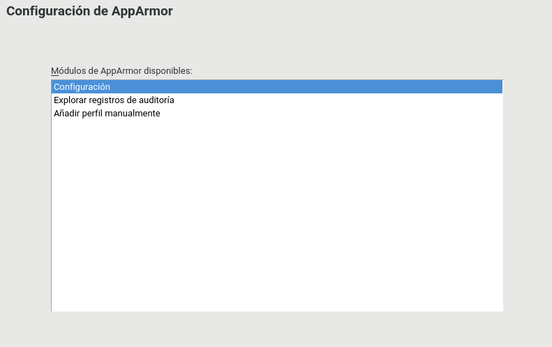

### 1.3. Los perfiles

El perfil es una configuración de seguridad que establece que permisos tiene un determinado ejecutable.

Herramientas como `aa-genprof`, nos puede ayudar a crear el perfil:
  * Crear un perfil con `aa-genprof`
  * Crear un perfil con `aa-autodep`

---

## 2. AppArmor: Práctica

### 2.1. Preparativos

> En la `Terminal 1`

* Abrimos una sesión con nuestro usuario, en mi caso `jorge`.
* Copiamos el programa `/bin/cp` con el nuevo nombre `/home/jorge/aa/mycopy`.

* Crearemos lo siguiente:
  * Crear directorio `/home/jorge/aa/elhalcon/`
  * `elhalcon/han.txt` Escribir el contenido *jorge24*
  * `elhalcon/chewaka.txt` Escribir el contenido *jorge24*
  * `elhalcon/leia.txt` Escribir el contenido *jorge24*
  * Crear directorio `/home/jorge/aa/ciudad-nube/`

* Probamos a copiar archivos con nuestro comando `mycopy`:
  * `cd /home/jorge/aa/`
  * `./mycopy elhalcon/* ciudad-nube`
  * Comprobamos el resultado -> `tree`

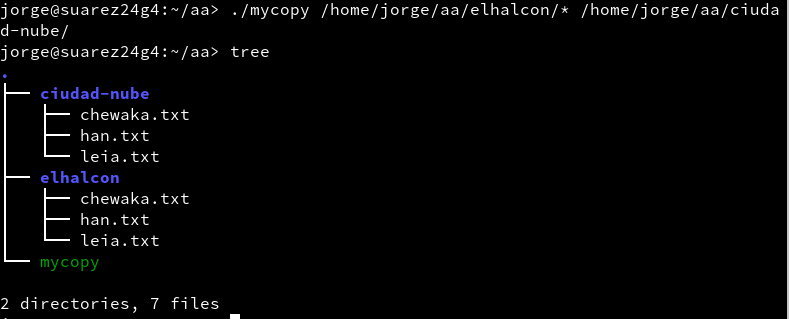

* Limpiamos el directorio con `rm ciudad-nube/*`

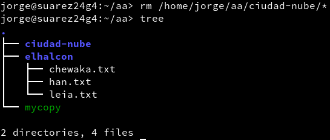

### 2.2. Generar el perfil

> En la `Terminal 2` como **root**

* Nos movemos al directorio donde se guardan los perfiles con `cd /etc/apparmor.d`
* `ls` para ver los perfiles que hay
* `aa-genprof /home/jorge/aa/mycopy` para iniciar la generación de un perfil. Este programa se queda en espera.

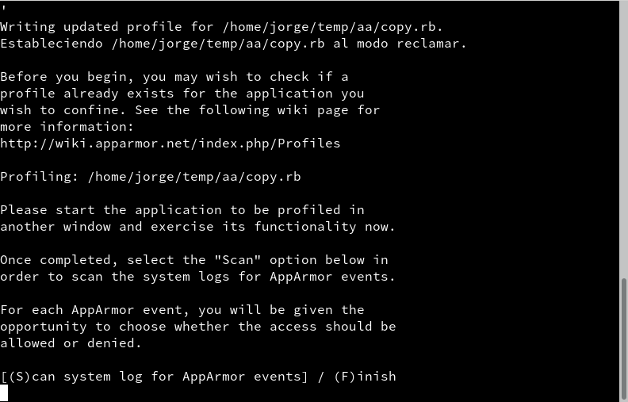

> En la `Terminal 1`

Ejecutamos el comando de copia
  * `./mycopy elhalcon/* ciudad-nube/`

> En la `Terminal 2` como **root**

* Empezamos el Scan pulsando "S".
* Permitir acceso de lectura a la ruta `elhalcon/*`
* Permitir acceso de escritura a la ruta `ciudad-nube/*`
* Pulsamos "S" para grabar el perfil.
* Con `ls` veremos el nuevo perfil creado.

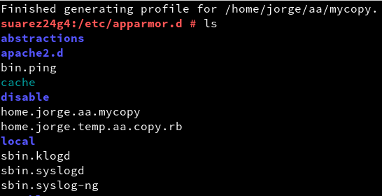

### 2.3. Comprobamos

Para comprobar el contenido del fichero usaremos:
  * `cat home.jorge.aa.mycopy`

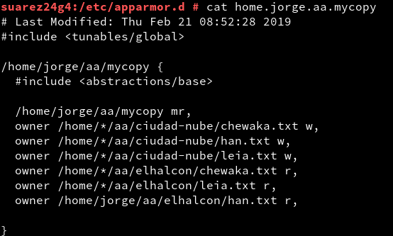

---

## 3. Forzamos el perfil

### 3.1. Preparativos

> En la `Terminal 2` como **root**

`aa-enforce home.jorge.aa.mycopy` para forzar el cumplimiento del perfil para el programa mycopy.

> En la `Terminal 1`

* Limpiamos y comprobamos con `rm ciudad-nube/*; tree`

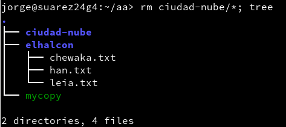

* `./mycopy elhalcon/* ciudadnube/`
* Comprobamos el resultado con `tree`
* Comprobamos que todo funciona igual de bien que siempre.

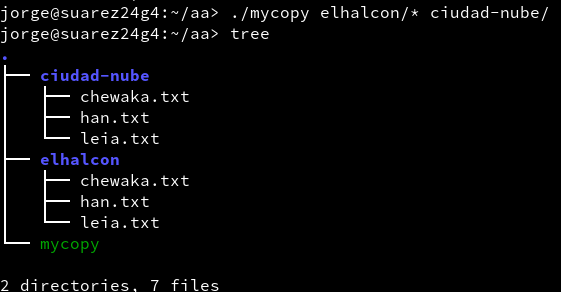

* Crear el directorio `/home/jorge/aa/nave-imperial`
* `./mycopy elhalcon/* nave-imperial/` debemos tener un problema de permisos ya que eso significa que el perfil de seguridad funciona correctamente.
* Comprobamos que no se han creado los archivos en el nuevo fichero.

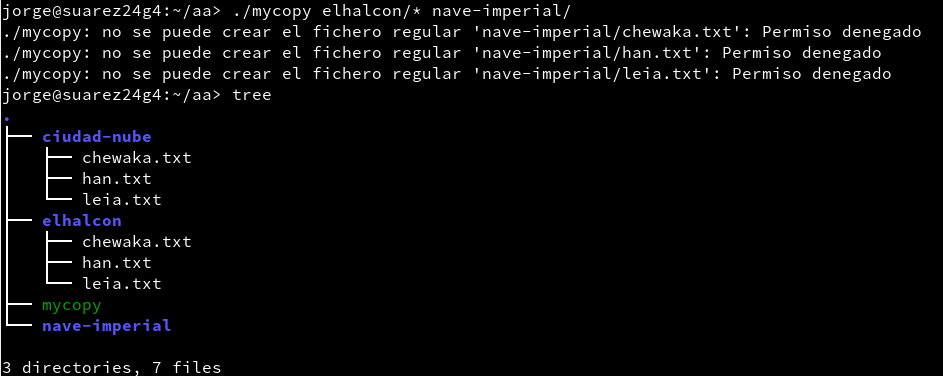

### 3.2. Comprobamos

> En la `Terminal 2` como **root**

* `apparmor_status` para consultar el estado de los perfiles.
* Tras esto comprobamos los eventos asociados a nuestro ejecutable:
  * `ausearch -x mycopy | aureport -u`
  * `cat /var/log/audit/audit.log | grep mycopy`

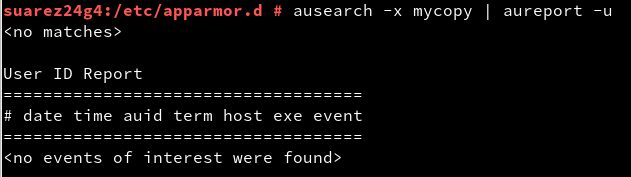

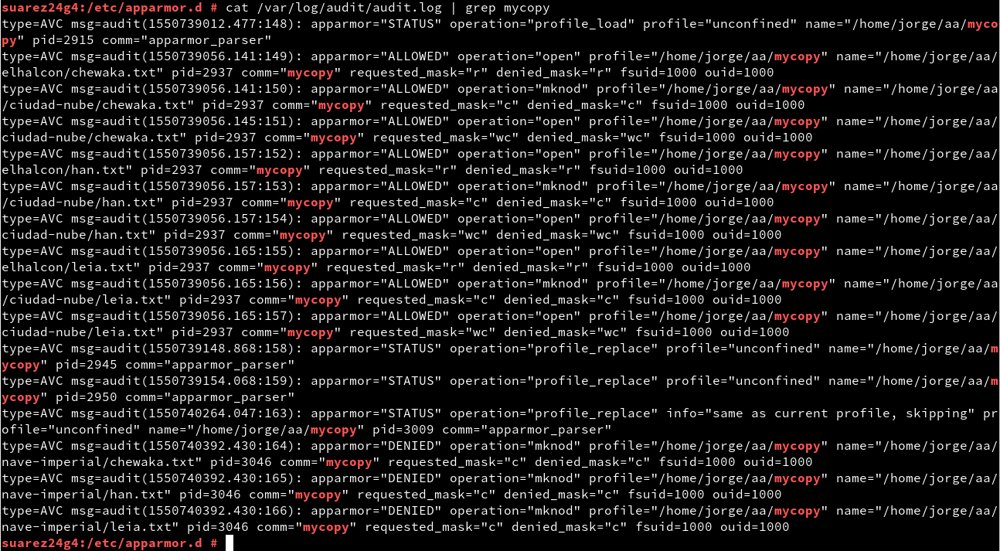

---

## 4. Modo queja

### 4.1. Perfil en modo queja

> En la `Terminal 2` como **root**

Ponemos el perfil en modo queja con `aa-complain home.jorge.aa.mycopy`. De esta forma no se prohìbe ninguna acción, pero si queda auditada.

> En la `Terminal 1`

* Comprobamos el contenidos de los directorios con `tree`.
* `./mycopy elhalcon/* nave-imperial` para copiarlos, ahora si debería funcionar el ejecutable.
* `tree` para comprobar que se copiaron satisfactoriamente.

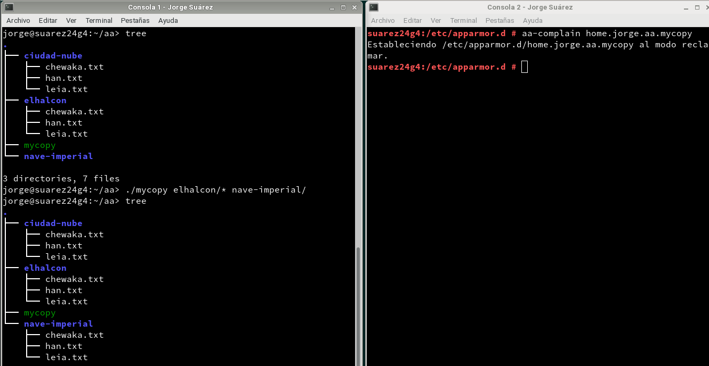

### 4.2. Comprobamos

> En la `Terminal 2` como **root**

* Consultamos el estado de los perfiles con `apparmor_status`
* Consultamos los eventos asociados a nuestro ejecutable con:
  * `ausearch -x mycopy | aureport -u`
  * `cat /var/log/audit/audit.log |grep mycopy`

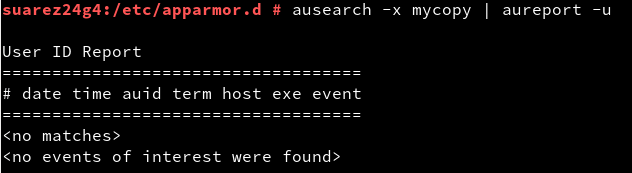

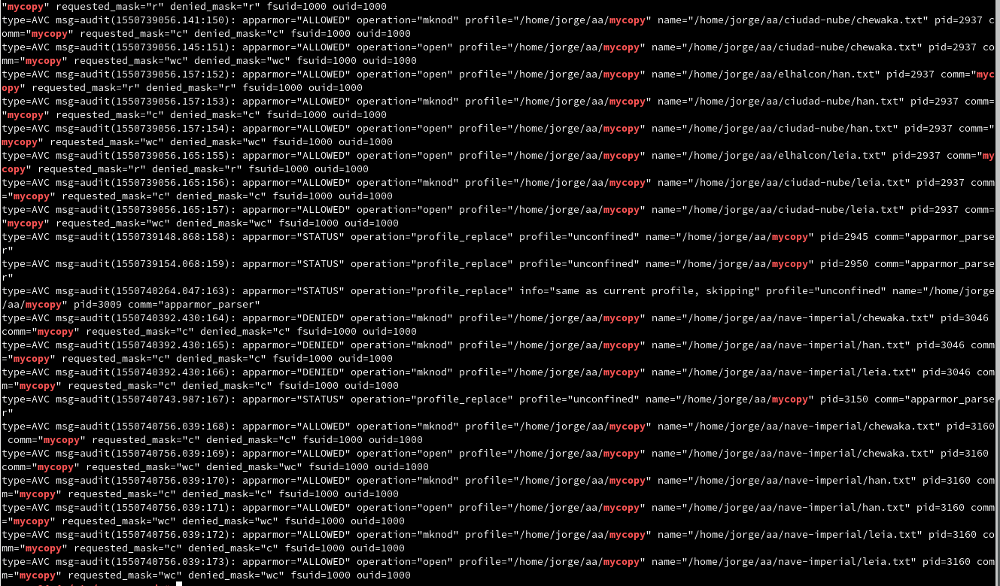
