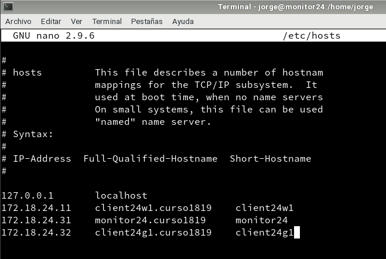

# Icinga OpenSUSE-Windows

---

## 1. Preparativos

### 1.1. Preparar las máquinas

ID  |  Hostname  |      IP      |
--- | ---------- | ------------ |
MV1 | monitor24  | 172.18.24.31 |
MV2 | client24g1 | 172.18.24.32 |
MV3 | client24w1 | 172.18.24.11 |

### 1.2. Configurar DNS local
Tenemos que incluir en todas las máquinas, las MV de la práctica.

> Máquinas OpenSUSE

* Incluir en el `/etc/hosts`

> Máquinas Windows

* Incluir en `C:\Windows\System32\drivers\etc\hosts`

---

## 2. Monitor: Instalación

### 2.1. Instalar el software principal

Instalar software:
  * `zypper install icinga2`
  * `icinga2 feature list`
  * `zypper install monitoring-plugins`

Iniciar y comprobar:
  * `systemctl enable icinga2`
  * `systemctl start icinga2`
  * `systemctl status icinga2`

### 2.2. Configurar los editores

---

## 3. Instalar el panel web

### 3.1. Base de datos

### 3.2. Servidor Web

### 3.3. Cortafuegos

### 3.4. Setting Up Icinga 2 REST API
