# PDC Windows Server

---

## 1. Preparativos

---

## 2. Instalar el Controlador de dominio

**Instalar en Windows 2008 Server**

* En Windows 2008 Server podemos abrir una consola `cmd` y ejecutar el comando `dcpromo`.

* Se inicia el asistente de configuración de los servicios del dominio de AD (Active Directory). Ponemos los siguientes valores:
  * No marcamos *`Modo avanzado`*
  * Marcamos *`Crear un dominio nuevo de un bosque nuevo`*
  * FQDN del dominio raíz del bosque: *`burgos24dom.curso1819`*
  * Nivel funcional del bosque: *`Windows Server 2008`*
  * Dejamos marcado *`Servidor DNS`*
  * Carpetas de almacenamiento *`Dejar valores por defecto`*
  * Ponemos una contraseña para el Administrador del dominio.

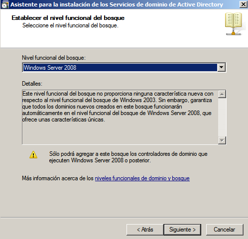

* En la pestaña `Resumen` comprobamos que hemos puesto todo correctamente y reiniciamos.

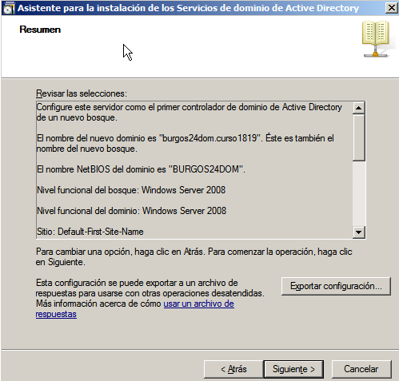

**Comprobaciones**

* Vamos a `DNS` dentro de `Herramientas` para comprobar que aparece dentro de `Zona de búsqueda directa` nuestro dominio.
* Abrir una consola y ejecutar `nslookup burgos24dom.curso1819`. Debe aparecer la IP de nuestro servidor PDC.

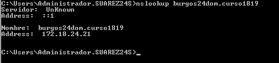

---

## 3. Usuarios del dominio

### 3.2. Práctica

Vamos a crear usuarios y grupos del dominio:

* Ir a `Usuarios y Equipos de Active Directory`

Grupo | `jedis1819`
------|-----------
**Ámbito de grupo** | Global
**Tipo de grupo** | Seguridad
**Usuarios de dominio** | `yoda` y `obiwan`

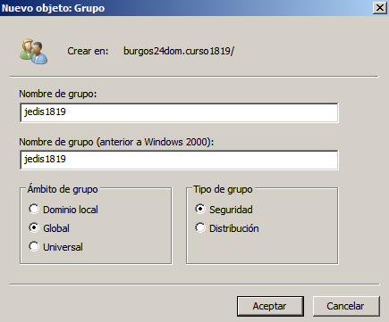

Grupo | `siths1819`
------|-----------
**Ámbito de grupo** | Global
**Tipo de grupo** | Seguridad
**Usuarios de dominio** | `vader` y `maul`

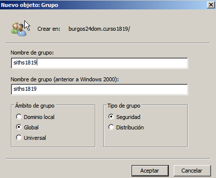

* No confundir usuarios locales con usuarios del dominio.

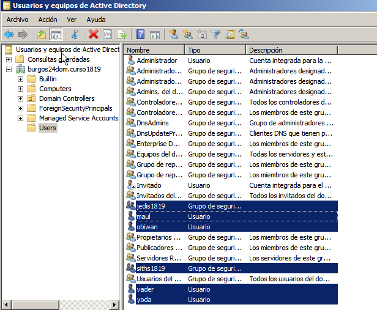

---

## 4. Equipos del dominio

### 4.1. Preparativos

#### MV Clientes

> FECHA/HORA: Es muy importante tener todos los equipos bien sincronizados en cuanto al reloj.

* **RED:** Cada cliente debe tener como DNS1 la `IP del PDC`, y como DNS2 al `8.8.4.4`

* Para comprobar, abrir una consola y ejecutar `nslookup burgos24dom.curso1819`. Debe aparecer la IP de nuestro servidor PDC.

**Cliente 1**

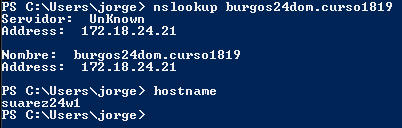

**Cliente 2**

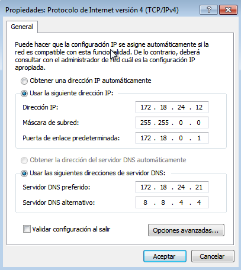

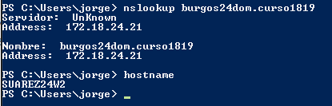

### 4.2. Unir equipo al dominio

Uniremos los equipos clientes al dominio:
  * Ir a `Propiedades` y dentro de `Miembro del Dominio:`, escribiremos el deseado, en mi caso `burgos24dom.curso1819`

**Cliente 1**

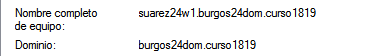

**Cliente 1**

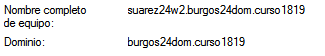

### 4.3. Problemas en la unión del dominio

***Solo si hubiera problemas en el apartado 4.2.***

Si tuviéramos poblemas al realizar esta tarea de unión del equipo al dominio, tenemos varias opciones:

1. Esperar 5 minutos y repetir el proceso. Las redes SMB/CIFS tardan un tiempo en propagar la información de los equipos por la red.

2. Volver a comprobar que todas las configuraciones son correctas. Repite el paso uno (NOTA: Pon un compañero contigo mientras lo haces. 4 ojos ven más que 2).

3. Si tenemos problemas con el DNS probar a configurar únicamente el DNS1 (ip del PDC).

4. Consultar la información que contiene el servidor DNS del W2k8server. Si está vacía probar a resinstalar AD y DNS en W2k8server (NOTA: Una configuración incorrecta del servidor DNS hará que no se puedan unir los equipos al dominio).

5. Probar a poner como puerta de enlace del cliente la IP del servidor PDC.

6. Configurar las máquinas servidor y cliente en la misma red interna de VirtualBox (Consultar configuración de red de VirtualBox) y vuelve a intentarlo (NOTA: Pueden darse problemas si se repiten IP's no nombres de máquinas en la red. Al crear una red interna tenemos una zona aislada bajo nuestro control).

### 4.4. Comprobaciones

Vamos al servidor (PDC) y comprobamos que nuestros dos equipos clientes se han unido al dominio satisfactoriamente.

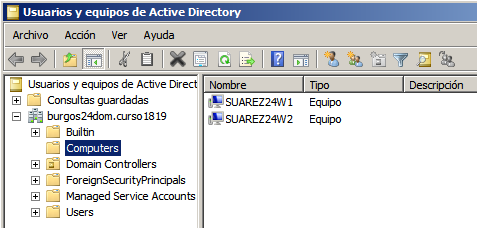

Ahora entraremos en los equipos clientes usando los usuarios del dominio. Podemos comprobarlos por entorno gráfico o usando comandos.

**Por entorno gráfico (Cliente 1)**

**Por comandos (Cliente 2)**

---

## 5. Perfiles móviles

### 5.1. Crear un segundo disco

### 5.2. Crear Perfiles de usuarios

### 5.3. Limpiar el equipo cliente

---

## 6. Perfiles obligatorios

---

## 7.Control de tiempo
* Modificamos los permisos de acceso a los usuarios del dominio, de la siguiente forma:
  * Los `"jedis"` sólo pueden acceder de *08:00 - 14:00* (de lunes a viernes)

  * Los `"siths"` sólo pueden acceder de *14:00 - 20:00* (de lunes a viernes)

