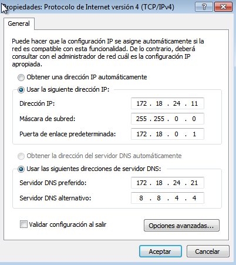
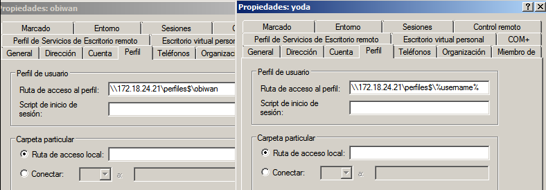

# PDC Windows Server

---

## 1. Preparativos

Para esta práctica será necesario:
  * 1 MV con Windows Server 2008 Enterprise

> Poner como DNS1 el valor `127.0.0.1` y como DNS2 `8.8.4.4`.

  * 2 MV's con Windows7 Enterprise

> Poner como DNS1 la `IP del servidor`, en mi caso `172.18.24.21` y como DNS2 `8.8.4.4`.

---

## 2. Instalar el Controlador de dominio

**Instalar en Windows 2008 Server**

* En Windows 2008 Server podemos abrir una consola `cmd` y ejecutar el comando `dcpromo`.

* Se inicia el asistente de configuración de los servicios del dominio de AD (Active Directory). Ponemos los siguientes valores:
  * No marcamos *`Modo avanzado`*
  * Marcamos *`Crear un dominio nuevo de un bosque nuevo`*
  * FQDN del dominio raíz del bosque: *`burgos24dom.curso1819`*
  * Nivel funcional del bosque: *`Windows Server 2008`*
  * Dejamos marcado *`Servidor DNS`*
  * Carpetas de almacenamiento *`Dejar valores por defecto`*
  * Ponemos una contraseña para el Administrador del dominio.

* En la pestaña `Resumen` comprobamos que hemos puesto todo correctamente y reiniciamos.

**Comprobaciones**

* Vamos a `DNS` dentro de `Herramientas` para comprobar que aparece dentro de `Zona de búsqueda directa` nuestro dominio.
* Abrir una consola y ejecutar `nslookup burgos24dom.curso1819`. Debe aparecer la IP de nuestro servidor PDC.

---

## 3. Usuarios del dominio

### 3.2. Práctica

Vamos a crear usuarios y grupos del dominio:

* Ir a `Usuarios y Equipos de Active Directory`

Grupo | `jedis1819`
------| :-----------:
**Ámbito de grupo** | Global
**Tipo de grupo** | Seguridad
**Usuarios de dominio** | `yoda` y `obiwan`

Grupo | `siths1819`
------| :-----------:
**Ámbito de grupo** | Global
**Tipo de grupo** | Seguridad
**Usuarios de dominio** | `vader` y `maul`

* No confundir usuarios locales con usuarios del dominio.

---

## 4. Equipos del dominio

### 4.1. Preparativos

#### MV Clientes

> FECHA/HORA: Es muy importante tener todos los equipos bien sincronizados en cuanto al reloj.

* **RED:** Cada cliente debe tener como DNS1 la `IP del PDC`, y como DNS2 al `8.8.4.4`

* Para comprobar, abrir una consola y ejecutar `nslookup burgos24dom.curso1819`. Debe aparecer la IP de nuestro servidor PDC.

**Cliente 1**

**Cliente 2**

### 4.2. Unir equipo al dominio

Uniremos los equipos clientes al dominio:
  * Ir a `Propiedades` y dentro de `Miembro del Dominio:`, escribiremos el deseado, en mi caso `burgos24dom.curso1819`

**Cliente 1**

**Cliente 2**

### 4.3. Problemas en la unión del dominio

***Solo si hubiera problemas en el apartado 4.2.***

Si tuviéramos poblemas al realizar esta tarea de unión del equipo al dominio, tenemos varias opciones:

1. Esperar 5 minutos y repetir el proceso. Las redes SMB/CIFS tardan un tiempo en propagar la información de los equipos por la red.

2. Volver a comprobar que todas las configuraciones son correctas. Repite el paso uno (NOTA: Pon un compañero contigo mientras lo haces. 4 ojos ven más que 2).

3. Si tenemos problemas con el DNS probar a configurar únicamente el DNS1 (ip del PDC).

4. Consultar la información que contiene el servidor DNS del W2k8server. Si está vacía probar a resinstalar AD y DNS en W2k8server (NOTA: Una configuración incorrecta del servidor DNS hará que no se puedan unir los equipos al dominio).

5. Probar a poner como puerta de enlace del cliente la IP del servidor PDC.

6. Configurar las máquinas servidor y cliente en la misma red interna de VirtualBox (Consultar configuración de red de VirtualBox) y vuelve a intentarlo (NOTA: Pueden darse problemas si se repiten IP's no nombres de máquinas en la red. Al crear una red interna tenemos una zona aislada bajo nuestro control).

### 4.4. Comprobaciones

Vamos al servidor (PDC) y comprobamos que nuestros dos equipos clientes se han unido al dominio satisfactoriamente.

Ahora entraremos en los equipos clientes usando los usuarios del dominio. Podemos comprobarlos por entorno gráfico o usando comandos.

**Por entorno gráfico (Cliente 1)**

* Vamos a la máquina cliente `Cliente1` y entramos con un usuario de dominio.
* Entramos en `Administración de equipos` y una vez ahí vamos a `Usuarios` dentro de `Usuarios y grupos locales`.

> Comprobamos que, efectivamente, los usuarios del dominio no aparecen.

**Por comandos (Cliente 2)**

* Vamos a la máquina cliente `Cliente2` y entramos con un usuario del dominio.
* Abrimos consola `PowerShell` y ejecutamos los siguientes comandos:
  * `whoami` muestra nuestro usuario actual del dominio.
  * `net user` muestra los usuarios locales del sistema, en los que no aparecen los del dominio.
  * `hostname` muestra el nombre del equipo.

---

## 5. Perfiles móviles

### 5.1. Crear un segundo disco

* Añadiremos un segundo disco al PDC de 1GB para guardar los perfiles de los usuarios del dominio.

* Formateamos el disco `NTFS` y le asignamos la letra `E`.
* Para ello, iremos a `Administrador de discos` dentro del `Administrador del servidor`.

### 5.2. Configurar la ruta de perfil de cada usuario

* En el PDC, crear la carpeta `E:\perfiles`.
* En dicha carpeta, definir permisos `lectura/escritura` para el grupo `Usuarios del dominio`.
* Usar modo avanzado para compartir la carpeta por red con el nombre `perfiles$`.

> Recuerda que para acceder a la carpeta compartida de red, los usuarios deben tener permisos en el recurso de red y en la carpeta del sistema de ficheros.

* Ahora vamos a la herramienta de gestión de `Usuarios del dominio`. Modificamos el atributo `ruta de acceso al perfil` en la pestaña `Perfil`, de los siguientes usuarios del dominio:

Usuario |          Ruta de acceso            
------- | :-------------------------------------:
yoda    | `\\172.18.24.21\perfiles$\%username%`
obiwan  | `\\172.18.24.21\perfiles$\obiwan`     
vader   | `\\172.18.24.21\perfiles$\%username%`
maul    | `\\172.18.24.21\perfiles$\maul`       

### 5.3. Personalizar los perfiles en **CLIENTE1**

* Para cada usuario modificamos el entorno del escritorio, colores e iconos.

Usuario | Carpeta | Archivo de texto | Contenido
:-------: | :-----: | :--------------: | :-------:
**obiwan**  | `jedi`    | `personajes.txt`   | `yoda` y `obiwan`
**maul**    | `sith`    | `personajes.txt`   | `vader` y `maul`

**Obiwan**

**Maul**

* Debemos comprobar que se han creado las carpetas con los perfiles en el sevidor para los usuarios anteriores.

### 5.4. Comprobar perfiles desde CLIENTE2

Vamos a comprobar el perfil móvil.
* Entramos con los usuarios del dominio `obiwan` y `maul`.
  * Abrir PowerShell y ejecutar los siguientes comandos
    * `hostname`
    * `whoami`
    * `more .\Desktop\CARPETA\personajes.txt`

> Sustituiremos CARPETA por `jedi` o `sith` según el usuario en el que lo estemos comprobando para ver el contenido del fichero de texto creado.

**Obiwan**

**Maul**

---

## 6. Perfiles obligatorios

* Primero vamos a dar permisos al usuario `Administrado` sobre el perfil de `maul` de la siguiente manera:
  * Desde Windows7 (cualquiera de los dos clientes), entramos con usuario `maul`.
  * Accedemos al recurso compartido `\\172.18.24.21\perfiles$`
  * Añadimos al usuario `Administrador` para que tenga control total en la carpeta `maul.V2`.
* Convertimos el perfil móvil del Sith Maul, a perfil obligatorio.
* Comprobamos que ahora el perfil es obligatorio yendo a `Configuración de Perfiles de usuario` dentro de las opciones avanzadas del `Sistema`.

---

## 7.Control de tiempo
* Modificamos los permisos de acceso a los usuarios del dominio, de la siguiente forma:
  * Los `"jedis"` sólo pueden acceder de *08:00 - 14:00* (de lunes a viernes)

  * Los `"siths"` sólo pueden acceder de *14:00 - 20:00* (de lunes a viernes)

