# PDC Políticas o directivas de grupo

---

## 2. Aplicar directivas de Usuario

### 2.1. Crear las OU y GPO

**IMPORTANTE** Antes de empezar la práctica crearemos una "snapshot" del PDC, para prevenir futuros problemas.

> **IMPORTANTE**: No aplicar la directivas a todo el dominio. SÓLO a las unidades organizativas que se especifiquen. Un error grave es aplicar las directivas a todo en lugar de a cada OU. Este error puede afectar al correcto funcionamiento del servidor.

Unidades Organizativas | `jedis24c1819` | `siths24c1819`
:--------------------- | :------------: | :------------:
**Usuarios**       | `obiwan` y `yoda`  | `vader` y `maul`
**GPO**                | `gpo_jedis24`  | `gpo_siths24`

**Unidades Organizativas**

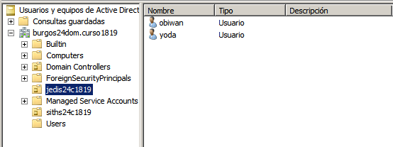

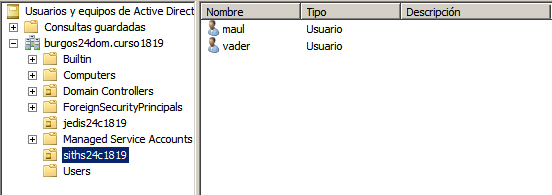

**GPO**

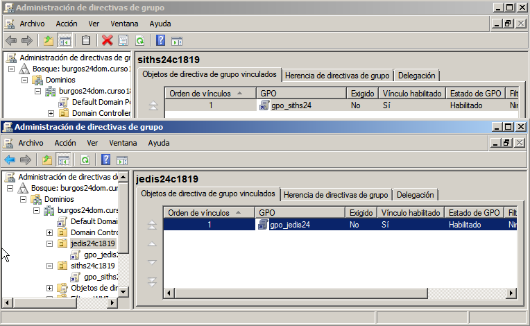

### 2.2. Personalizar cada GPO de forma diferente

> INFO Para editar configuraciones de Directiva de grupo:
>
> * En Group Policy Management (Administración de directivas de grupo), en el árbol de consola, desplegar Group Policy Objects (Objetos de Directiva de grupo). Click con el botón derecho del ratón en el GPO y seleccionar Edit (Editar).
> * En el Editor de objetos de Directiva de grupo, buscar la Directiva de grupo que queremos modificar y hacemos doble clic. En el cuadro de diálogo Propiedades, cambiamos la configuración y Aceptar.

Ahora aplicaremos y habilitaremos las siguientes directivas a las OU anteriores.
* Encontraremos todas las siguientes dentro de `Configuración de usuario / Directivas / Plantillas administrativas`

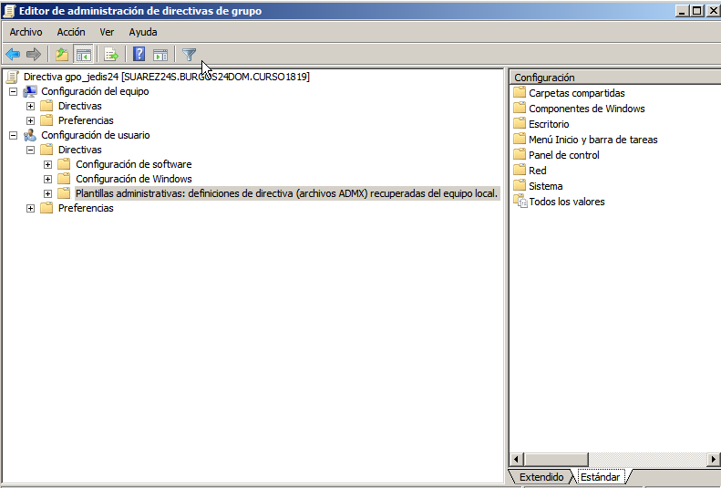

#### OU jedis24c1819

| Menú Inicio y barra de tareas
| :-----------------------------------------:
| `Quitar el menú Ejecutar del menú Inicio`
| `Quitar el icono Red del menú Inicio`
| `Quitar icono de red`
| `Quitar Conexiones de red del menú Inicio`

#### OU siths24c1819

| Panel de Control
| :---------------------------------------:
| `Prohibir el acceso al Panel de control`

| Escritorio
| :-----------------------------------------:
| `Ocultar el icono Ubicaciones de red del escritorio`

| Componentes de Windows / Explorador de Windows
| :---------------------------------------------:
| `Quitar "Conectar a unidad de red" y "Desconectar de unidad de red"`

### 2.3. Comprobar que se aplican las directivas

Al terminar de configurar las directivas, haremos lo siguiente:
* Abrir consola como administrador y ejecutar `gpupdate /force` para forzar las actualizaciones de las directivas.

> En algunos casos, después de definir una política, ésta tarda un tiempo en activarse, pero usando el comando anterior, nos aseguramos de que este paso de activación se realice inmediatamente.

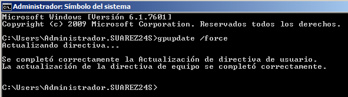

* Ir a `Administración de Directivas de Grupo` y comprobar el resumen de la configuración de cada una de las directivas creadas.

**GPO jedis24**

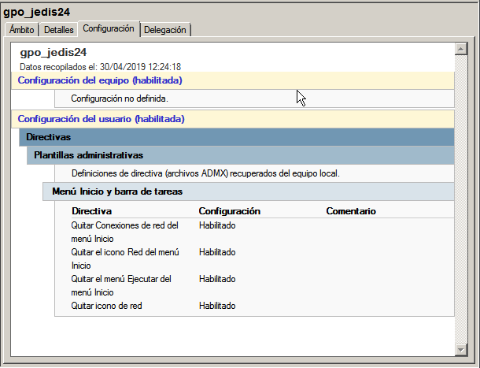

**GPO siths24**

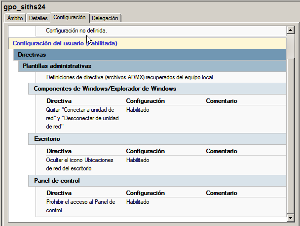

* Ahora comprobamos los efectos de las directivas de usuario en las MV clientes.

**Cliente 1**
Comprobamos en el `Cliente 1` con un usuario de la OU `jedis24c1819`, en mi caso `obiwan`.

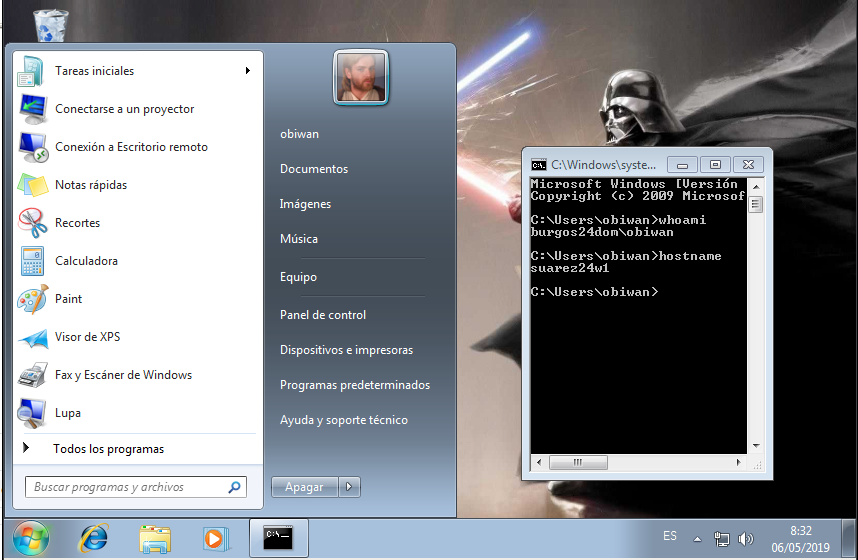

**Cliente 2**
Después comprobamos en el `Cliente 2` con un usuario de la OU `siths24c1819`, en mi caso `maul`.

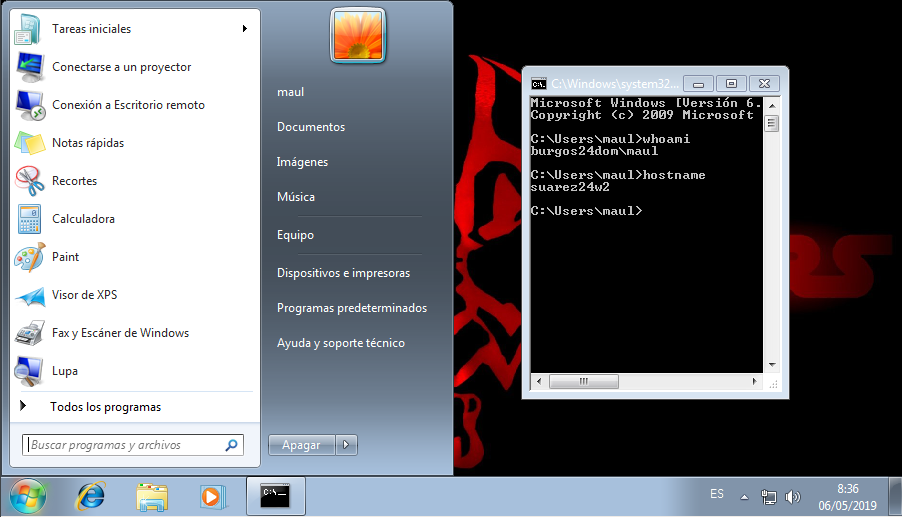

---

## 3. Aplicar directiva de Equipo

### 3.1. Instalar en el servidor

Ahora vamos a crear nuestro propio paquete de instalación MSI.

**En el servidor**
* Descargamos e instalamos el programa `WinINSTALL`.
* Una vez instalada la aplicación hemos de asignar permisos de acceso al recurso compartido de WinINSTALL al usuario `Administrador`

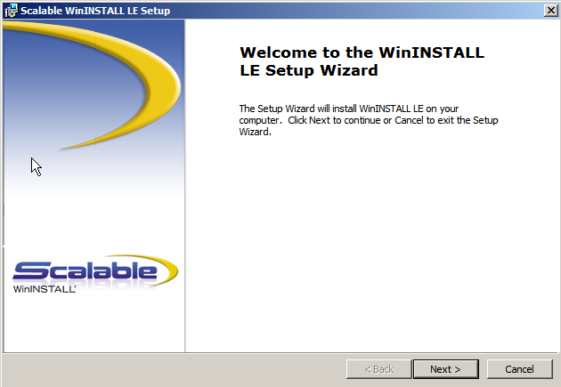

* Creamos la carpeta `e:\software24`

**Permisos sobre la Carpeta**

Permisos | **`Usuarios del dominio`** | **`Administradores`**
-------- | :------------------------: | :-----------:
Control total |    |   &#x2714;
Modificar |             | &#x2714;
Lectura y ejecución |        &#x2714;         | &#x2714;
Mostrar el contenido de la carpeta |     &#x2714;     | &#x2714;
Lectura |       &#x2714;         | &#x2714;
Escritura |             | &#x2714;
Permisos especiales |             | &#x2714;

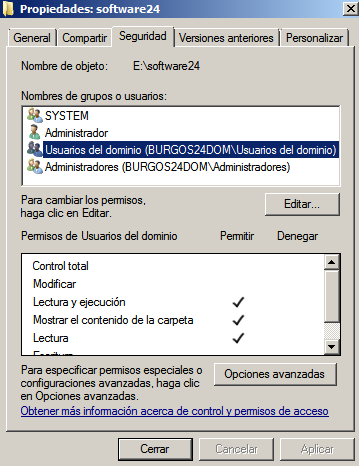

Permisos |

### 3.2. Crear paquete MSI

### 3.3. Crear nueva GPO en el servidor

### 3.4. Comprobar desde los clientes

