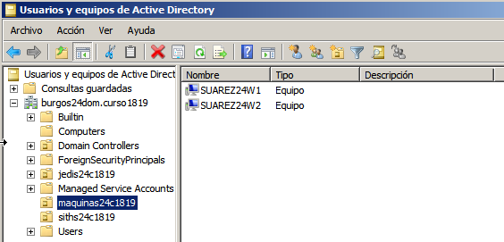

# PDC Políticas o directivas de grupo

---

## 2. Aplicar directivas de Usuario

### 2.1. Crear las OU y GPO

**IMPORTANTE** Antes de empezar la práctica crearemos una "snapshot" del PDC, para prevenir futuros problemas.

> **IMPORTANTE**: No aplicar la directivas a todo el dominio. SÓLO a las unidades organizativas que se especifiquen. Un error grave es aplicar las directivas a todo en lugar de a cada OU. Este error puede afectar al correcto funcionamiento del servidor.

Unidades Organizativas | `jedis24c1819` | `siths24c1819`
:--------------------- | :------------: | :------------:
**Usuarios**       | `obiwan` y `yoda`  | `vader` y `maul`
**GPO**                | `gpo_jedis24`  | `gpo_siths24`

**Unidades Organizativas**

**GPO**

### 2.2. Personalizar cada GPO de forma diferente

> INFO Para editar configuraciones de Directiva de grupo:
>
> * En Group Policy Management (Administración de directivas de grupo), en el árbol de consola, desplegar Group Policy Objects (Objetos de Directiva de grupo). Click con el botón derecho del ratón en el GPO y seleccionar Edit (Editar).
> * En el Editor de objetos de Directiva de grupo, buscar la Directiva de grupo que queremos modificar y hacemos doble clic. En el cuadro de diálogo Propiedades, cambiamos la configuración y Aceptar.

Ahora aplicaremos y habilitaremos las siguientes directivas a las OU anteriores.
* Encontraremos todas las siguientes dentro de `Configuración de usuario / Directivas / Plantillas administrativas`

#### OU jedis24c1819

| Menú Inicio y barra de tareas
| :-----------------------------------------:
| `Quitar el menú Ejecutar del menú Inicio`
| `Quitar el icono Red del menú Inicio`
| `Quitar icono de red`
| `Quitar Conexiones de red del menú Inicio`

#### OU siths24c1819

| Panel de Control
| :---------------------------------------:
| `Prohibir el acceso al Panel de control`

| Escritorio
| :-----------------------------------------:
| `Ocultar el icono Ubicaciones de red del escritorio`

| Componentes de Windows / Explorador de Windows
| :---------------------------------------------:
| `Quitar "Conectar a unidad de red" y "Desconectar de unidad de red"`

### 2.3. Comprobar que se aplican las directivas

Al terminar de configurar las directivas, haremos lo siguiente:
* Abrir consola como administrador y ejecutar `gpupdate /force` para forzar las actualizaciones de las directivas.

> En algunos casos, después de definir una política, ésta tarda un tiempo en activarse, pero usando el comando anterior, nos aseguramos de que este paso de activación se realice inmediatamente.

* Ir a `Administración de Directivas de Grupo` y comprobar el resumen de la configuración de cada una de las directivas creadas.

**GPO jedis24**

**GPO siths24**

* Ahora comprobamos los efectos de las directivas de usuario en las MV clientes.

**Cliente 1**

Comprobamos en el `Cliente 1` con un usuario de la OU `jedis24c1819`, en mi caso `obiwan`.

**Cliente 2**

Después comprobamos en el `Cliente 2` con un usuario de la OU `siths24c1819`, en mi caso `maul`.

---

## 3. Aplicar directiva de Equipo

### 3.1. Crear recurso compartido de red

* Creamos la carpeta `e:\software24`

Permisos | **`Usuarios del dominio`** | **`Administradores`**
-------- | :------------------------: | :-----------:
Control total |    |   &#x2714;
Modificar |             | &#x2714;
Lectura y ejecución |        &#x2714;         | &#x2714;
Mostrar el contenido de la carpeta |     &#x2714;     | &#x2714;
Lectura |       &#x2714;         | &#x2714;
Escritura |             | &#x2714;
Permisos especiales |             | &#x2714;

* Creamos el recurso compartido de red `software24` a la carpeta anterior

Permisos |        **`Todos`**         | **`Usuarios del dominio`**
-------- | :------------------------: | :------------------------:
Control total |                       |       &#x2714;
Cambiar |                             |       &#x2714;
Leer |         &#x2714;               |       &#x2714;

* Creamos la subcarpeta `E:\software24\firefox`.

### 3.2. Instalar en el servidor

Ahora vamos a crear nuestro propio paquete de instalación MSI.

* Descargamos e instalamos el programa `WinINSTALL`.

* Una vez instalada la aplicación hemos de asignar permisos de acceso al recurso compartido de WinINSTALL al usuario `Administrador` en modo `Leer`.

### 3.3. Crear paquete MSI

**En el cliente**

* Entramos con el usuario administrador del dominio
* Descargamos el instalador de Firefox.

> **¡OJO!** Sólo descargar. No instalar todavía. El instalador de Firefox debe tener un tamaño de varios MBs. Si tiene pocos KBs no es el instalador, sino un programa para descargar el instalador.

* Iniciamos la aplicación WinINSTALL LE de forma remota ejecutando `\\172.18.24.21\WinINSTALL\Bin\Discover.exe`

* Indicamos el nombre que vamos a asociar al paquete MSI y la ruta de red donde almacenaremos el MSI, en nuestro caso:
  * Nombre: `firefox24.msi`
  * Ruta de red: `\\172.18.24.21\software24\firefox\firefox24.msi`

* Unidad donde se almacenarán los ficheros temporales -> `C:`.
* Unidades que serán analizadas para realizar la foto inicial -> La unidad `C:` de nuestro equipo cliente.

> En mi caso, la unidad `D` es en la que está el `Guest Additions`.

* Indicar los ficheros que serán excluidos del análisis -> Aceptaremos las opciones propuestas por el asistente por defecto.
* Pulsamos Finish para comenzar la generación de la foto inicial del equipo.

> **¡MUY IMPORTANTE!**
> **En el tiempo comprendido entre la ejecución de este proceso y la ejecución del proceso de la foto final, es crítico ejecutar únicamente el software de instalación del paquete MSI a generar. Cualquier modificación que se haga durante este proceso, se grabará en el paquete MSI obtenido, aunque no forme parte de las modificaciones realizadas de la aplicación durante su instalación.**

* Una vez que la foto inicial haya sido realizada, pulsamos `Aceptar`, y a continuación se nos mostrará otra ventana en el que seleccionaremos el fichero de instalación `firefox.exe` de la que vamos a generar el paquete MSI.
* Comenzamos la instalación de la aplicación de firefox.exe de modo manual.
Volvemos a ejecutar `\\172.18.24.21\WinINSTALL\Bin\Discover.exe`, para iniciar el proceso de creación de la foto final del sistema.

> Esto puede durar varios minutos.

**En el SERVIDOR**
* Comprobamos que se ha creado correctamente el paquete yendo a la carpeta `E:\software24\firefox`

**En el Cliente**

* Tras comprobar, limpiamos el equipo cliente:
  * Eliminamos el fichero `firefox.exe`
  * Desinstalamos FirefoxDesinstalar el programa Firefox del cliente.

### 3.4. Crear nueva GPO en el servidor

* Creamos la OU `maquinas24c1819` y movemos los equipos del dominio dentro de esta OU.

* Dentro de la OU anterior, creamos la nueva directiva `gpo_software24`.
* Editamos la nueva directiva.
  * Elegir el paquete: `\\172.18.24.21\software24\firefox\firefox24.msi`
  * Configurar la instalación del paquete en modo `Asignada`

* En la GPO. Añadimos `Usuarios del dominio` en el `Filtrado de seguridad`.

* Abrir consola como administrador y ejecutar `gpupdate /force` para forzar las actualizaciones de la directiva.

### 3.5. Comprobar desde los clientes

* Entramos con un usuario del dominio y se debe haber instalado automáticamente el programa que hemos configurado en las directivas.

> Puede tardar bastante tiempo, no desesperarse.

* Mostrar salida de los comandos: `whoami` y `hostname`.

