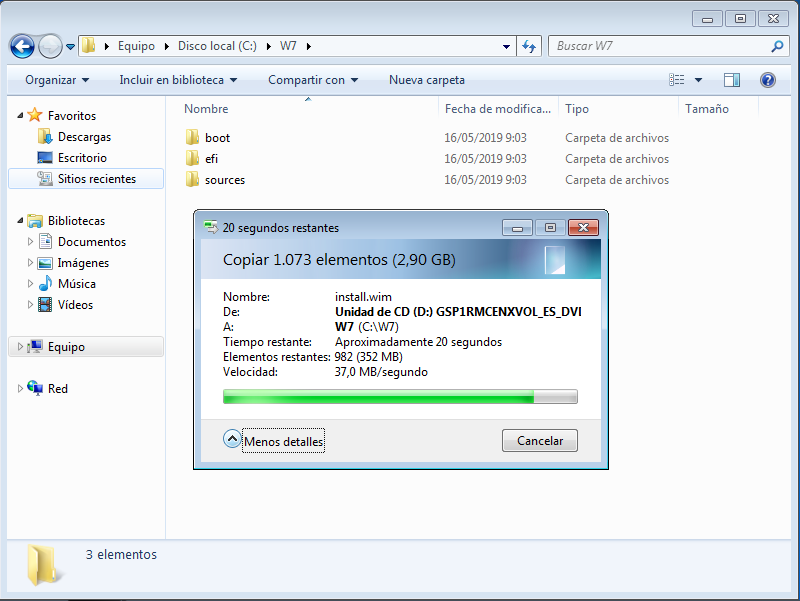
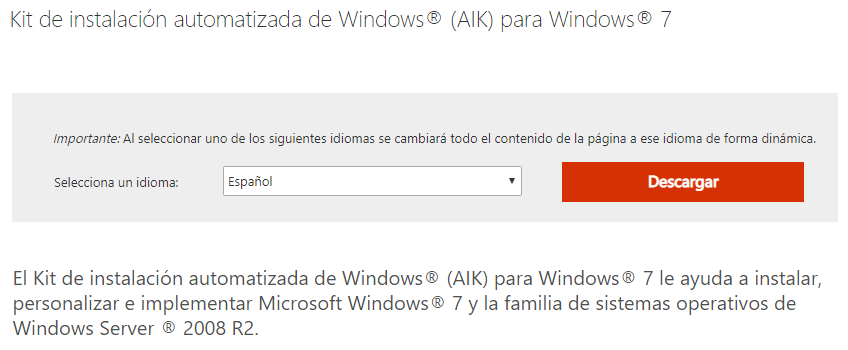
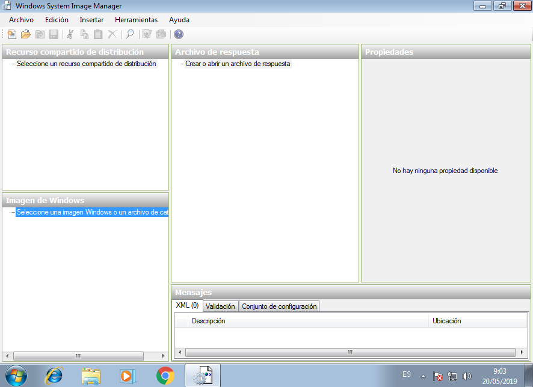
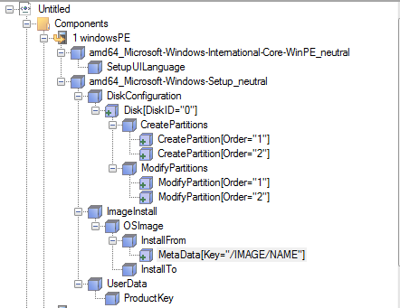
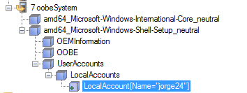
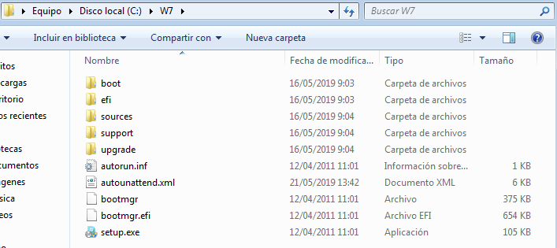
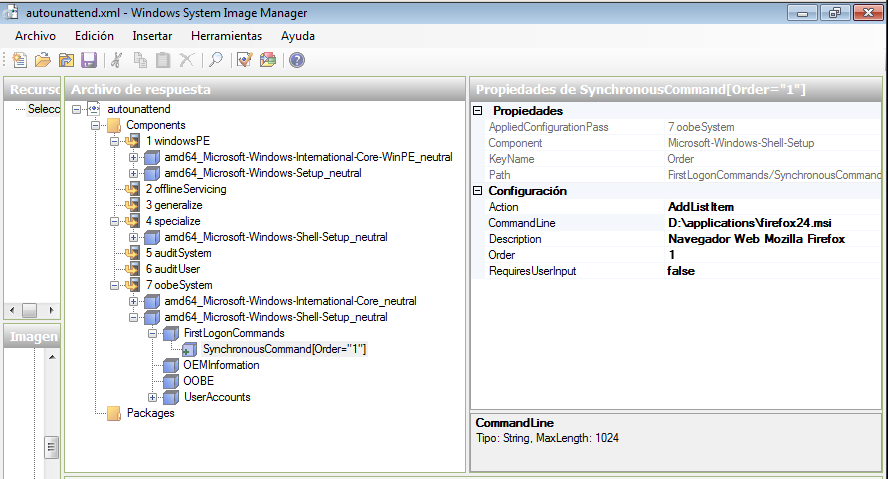
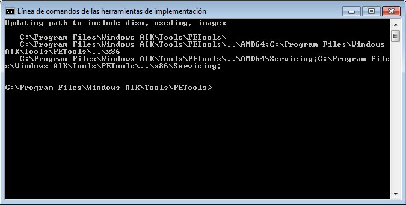
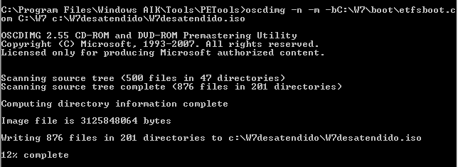
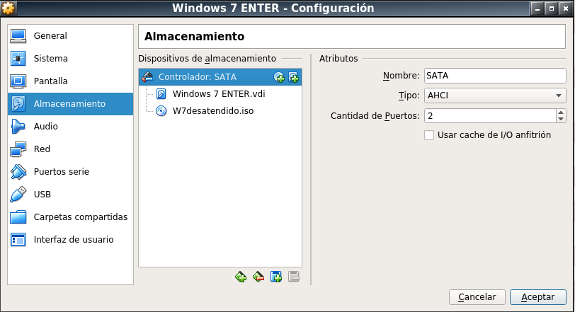

# Instalación desatendida de Windows7

---

## 1. Instalar WAIK

### 1.1. Copiar ficheros

* Creamos la carpeta `C:\W7`.
* Montamos la ISO Windows 7 Enterprise de 64 bits en la unidad CD de la MV.
* Copiamos el contenido de la unidad de CD a la carpeta `C:\W7`.

### 1.2. Descargar e instalar WAIK

> Descargamos la ISO en la máquina real y la añadimos a la máquina de Windows7 donde creamos la carpeta `C:\W7`.

* Descargamos el Kit de instalación automatizada de Windows (AIK) para Windows 7.

* Instalamos la herramienta `WAIK`.

* Ir a `Administrador de imágenes del sistema de Windows` que se encuentra dentro de `Microsoft Windows AIK`. Ejecutar como administrador.

---

## 2. Crear fichero de respuestas

### 2.1. Abrir el archivo de catálogo

Ahora crearemos un catálogo que es el que nos dirá que tiene, que se puede  y no se puede hacer dentro de la imagen seleccionada de Windows 7.

* Vamos a `Archivo` -> `Seleccionar imagen de Windows` y buscamos el archivo siguiente:
  * `C:\W7\sources\install_Windows 7 ENTERPRISE.clg`.
* Nos saldrá en la esquina inferior izquierda una lista que podemos desplegar con diferentes componentes y paquetes.

### 2.2.Crear el archivo de respuestas (autounattend.xml)

* Creamos el archivo de autorespuesta que configuraremos a continuación. Ir a `Archivo` -> `Nuevo archivo de respuesta`.
* Para agregar componentes hacemos lo siguiente:
  1. Buscamos los componentes en la parte izquierda.
  2. Hay que añadirlos en el ciclo que se indica
  3. Posteriormente completamos los valores de los parámetros asociados.

<table>
  <tr>
    <th colspan="3">windowsPE</th>
  </tr>
  <tr>
    <th>Componente</th>
    <th colspan="2">Parámetros</th>
  </tr>
  <tr>
     <td rowspan="4">amd64-Microsoft-Windows-International-Core-WinPE</td>
     <th>InputLocale</th>
     <td>es-ES</td>
  </tr>
  <tr>
    <th>SystemLocale</th>
    <td>es-ES</td>
  </tr>
  <tr>
    <th>UILanguage</th>
    <td>es-ES</td>
  </tr>
  <tr>
    <th>UserLocale</th>
    <td>es-ES</td>
  </tr>
  <tr>
     <td rowspan="2">amd64-Microsoft-Windows-International-Core / SetupUILanguage</td>
     <th>UILanguage</th>
     <td>es-ES</td>
  </tr>
  <tr>
    <th>WillShowUI</th>
    <td>OnError</td>
  </tr>
  <tr>
     <td>amd64-Windows-Setup / DiskConfiguration</td>
     <th>WillShowUI</th>
     <td>OnError</td>
  </tr>
  <tr>
     <td rowspan="2">amd64-Windows-Setup / DiskConfiguration / Disk</td>
     <th>DiskID</th>
     <td>0</td>
  </tr>
  <tr>
    <th>WillWipeDisk</th>
    <td>true</td>
  </tr>
  <tr>
     <td rowspan="3">amd64-Windows-Setup / DiskConfiguration / Disk / CreatePartitions / CreatePartition</td>
     <th>Order</th>
     <td>1</td>
  </tr>
  <tr>
    <th>Size</th>
    <td>200</td>
  </tr>
  <tr>
    <th>Type</th>
    <td>primary</td>
  </tr>
  <tr>
     <td rowspan="2">amd64-Windows-Setup / DiskConfiguration / Disk / CreatePartitions / CreatePartition</td>
     <th>Order</th>
     <td>2</td>
  </tr>
  <tr>
    <th>Type</th>
    <td>primary</td>
  </tr>
  <tr>
     <td rowspan="5">amd64-Windows-Setup / DiskConfiguration / Disk / ModifyPartitions / ModifyPartition</td>
     <th>Active</th>
     <td>true</td>
  </tr>
  <tr>
    <th>Format</th>
    <td>NTFS</td>
  </tr>
  <tr>
    <th>label</th>
    <td>System</td>
  </tr>
  <tr>
    <th>Order</th>
    <td>1</td>
  </tr>
  <tr>
    <th>PartitionID</th>
    <td>1</td>
  </tr>
  <tr>
     <td rowspan="6">amd64-Windows-Setup / DiskConfiguration / Disk / ModifyPartitions / ModifyPartition</td>
     <th>Extend</th>
     <td>true</td>
  </tr>
  <tr>
    <th>Format</th>
    <td>NTFS</td>
  </tr>
  <tr>
    <th>label</th>
    <td>Windows7</td>
  </tr>
  <tr>
    <th>Letter</th>
    <td>C</td>
  </tr>
  <tr>
    <th>Order</th>
    <td>2</td>
  </tr>
  <tr>
    <th>PartitionID</th>
    <td>2</td>
  </tr>
  <tr>
     <td rowspan="2">amd64-Windows-Setup / ImageInstall / OSImage</td>
     <th>InstallToAvailablePartition</th>
     <td>false</td>
  </tr>
  <tr>
    <th>WillShowUI</th>
    <td>OnError</td>
  </tr>
  <tr>
     <td rowspan="2">amd64-Windows-Setup / ImageInstall / OSImage / InstallTo</td>
     <th>DiskID</th>
     <td>0</td>
  </tr>
  <tr>
    <th>PartitionID</th>
    <td>2</td>
  </tr>
  <tr>
     <td rowspan="2">amd64-Windows-Setup / ImageInstall / OSImage / InstallFrom / MetaData</td>
     <th>Key</th>
     <td>/IMAGE/NAME</td>
  </tr>
  <tr>
    <th>Value</th>
    <td>Windows 7 ENTERPRISE</td>
  </tr>
  <tr>
     <td rowspan="3">amd64-Windows-Setup / UserData / ProductKey</td>
     <th>Key</th>
     <td>(serial del producto)</td>
  </tr>
  <tr>
    <th>WillShowUI</th>
    <td>OnError</td>
  </tr>
</table>

<table>
  <tr>
    <th colspan="3">oobeSystem</th>
  </tr>
  <tr>
    <th>Componente</th>
    <th colspan="2">Parámetros</th>
  </tr>
  <tr>
     <td rowspan="3">amd64-Microsoft-Windows-Shell-Setup</td>
     <th>RegisteredOrganization</th>
     <td>Contoso</td>
  </tr>
  <tr>
    <th>RegisteredOwner</th>
    <td>DemoUser</td>
  </tr>
  <tr>
    <th>TimeZone</th>
    <td>GMT Standard Time</td>
  </tr>
  <tr>
     <td rowspan="2">amd64-Microsoft-Windows-Shell-Setup / OOBE</td>
     <th>HideEULAPage</th>
     <td>true</td>
  </tr>
  <tr>
    <th>NetworkLocation</th>
    <td>Home</td>
  </tr>
  <tr>
     <td rowspan="4">amd64-Microsoft-Windows-Shell-Setup / UserAccount /LocalAccounts / LocalAccount</td>
     <th>Description</th>
     <td>Administrador</td>
  </tr>
  <tr>
    <th>DisplayName</th>
    <td>DemoUser</td>
  </tr>
  <tr>
    <th>Group</th>
    <td>administrators</td>
  </tr>
  <tr>
    <th>Name</th>
    <td>DemoUser</td>
  </tr>
  <tr>
     <td rowspan="4">amd64-Microsoft-Windows-Shell-Setup / OEMInformation</td>
     <th>HelpCustomized</th>
     <td>false</td>
  </tr>
  <tr>
    <th>Manufacturer</th>
    <td>Contoso</td>
  </tr>
  <tr>
    <th>SupportHours</th>
    <td>24/7</td>
  </tr>
  <tr>
    <th>SupportURL</th>
    <td>geeks.ms/blogs/checho</td>
  </tr>
  <tr>
     <td rowspan="4">amd64-Microsoft-Windows-International-Core...neutral</td>
     <th>InputLocale</th>
     <td>es-ES</td>
  </tr>
  <tr>
    <th>SystemLocale</th>
    <td>es-ES</td>
  </tr>
  <tr>
    <th>UILanguage</th>
    <td>es-ES</td>
  </tr>
  <tr>
    <th>UserLocale</th>
    <td>es-ES</td>
  </tr>
</table>

<table>
  <tr>
    <th colspan="3">specialize</th>
  </tr>
  <tr>
    <th>Componente</th>
    <th colspan="2">Parámetros</th>
  </tr>
  <tr>
     <td>amd64-Microsoft-Windows-Shell-Setup</td>
     <th>ComputerName</th>
     <td>suarez24w</td>
  </tr>
</table>

### 2.3. Validar y guardar respuestas

* Validamos el archivo de respuesta yendo a `Herramientas` -> `Validar archivo de respuesta`.
* Guardamos el archivo de respuesta yendo `Archivo` -> `Guardar archivo de respuesta como`. Elegimos la ruta `C:\W7\autounattend.xml`.

---

## 3. Configurar aplicaciones

* Crear la carpeta `C:\W7\applications`. Dentro pondremos un programa de instalación MSI. En mi caso añadí el Firefox.

* Para que la instación automática de las aplicaciones que queramos al iniciarse el sistema después de su instalación deberemos agregar el componente a `autounattend.xml`:

<table>
    <th>Componente</th>
    <th colspan="2">Parámetros</th>
  </tr>
  <tr>
     <td rowspan="4">amd64-Microsoft-Windows-Shell-Setup</td>
     <th>CommandLine</th>
     <td>D:\applications\ejecutable.msi</td>
  </tr>
  <tr>
    <th>Description</th>
    <td>Navegador web Mozilla Firefox</td>
  </tr>
  <tr>
    <th>Order</th>
    <td>1</td>
  </tr>
  <tr>
    <th>RequiresUserInput</th>
    <td>false</td>
  </tr>
</table>

---

## 4. Validar y guardar

* Validamos el archivo de respuesta yendo a `Herramientas` -> `Validar archivo de respuesta`.
* Guardamos el archivo de respuesta yendo `Archivo` -> `Guardar archivo de respuesta`. Elegimos la ruta `C:\W7\autounattend.xml`.

---

## 5. Crear la ISO

* Creamos la carpeta `C:\W7desatendido`.
* Para crear la ISO, abrimos `Línea de comandos de las herramientas de implementación` y se nos abrirá una consola de comandos.

* Escribimos `oscdimg -n -m -bC:\W7\boot\etfsboot.com C:\W7 c:\W7desatendido\W7desatendido.iso`.
* Si todo es correcto comenzará la creación de nuestra ISO de Windows 7 ENTERPRISE desatendida.

---

## 6. Comprobamos la ISO

* Al terminar probamos a instalar el SO con la nueva ISO en una máquina virtual.

---
