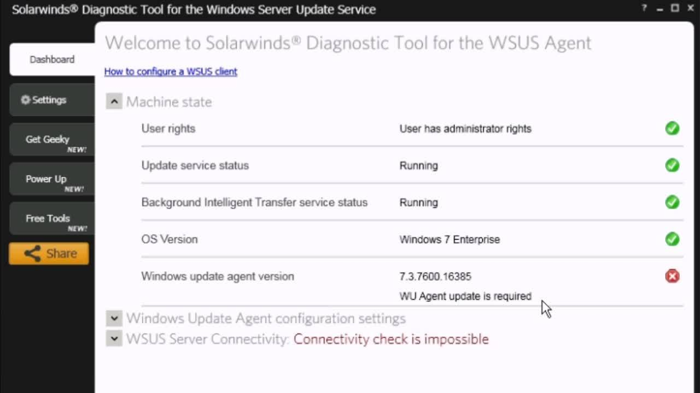

# Servidor de actualizaciones

---

## 1. WSUS (Windows Server Update Services)

### 1.1. Teoría

### 1.2. Preparativos

---

## 2. Servidor WSUS

### 2.1. Teoría

### 2.2. Instalación del servidor

### 2.3. Configuración del servidor

### 2.4. Servicio con inicio automático

---

## 3. Cliente WSUS

### 3.1. Teoría

### 3.2. Configurar el cliente

**Configurar sin PDC**

### 3.3. Comprobación

### 3.4. Servicio en el cliente

### 3.5. En el caso de tener PROBLEMAS

**Sólo en caso de tener problemas de conexión del cliente WSUS con el servidor.**

* Descargar y ejecutar Herramienta de diagnóstico WSUS desde línea de comandos.
* Algunos problemas de cliente WSUS se solucionan con la siguiente herramienta:
  * Descargar herramienta Solucionador WSUS
  * https://support.microsoft.com/es-es/help/10164/fix-windows-update-errors
* `sfc /scannow`, repara archivos dañados.

> Imagen de EJEMPLO

---

## 4. Auditar procesos

### 4.1. Auditar desde el servidor

