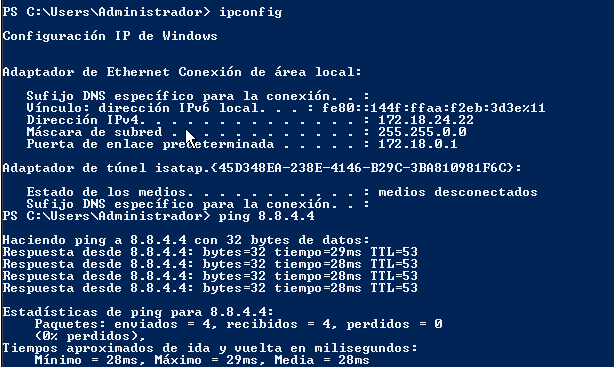
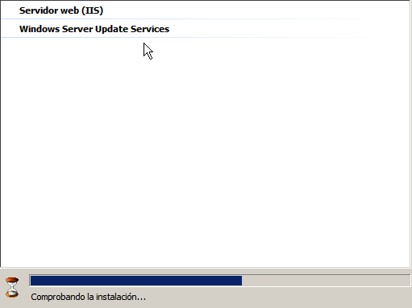

# Servidor de actualizaciones

---

## 1. WSUS (Windows Server Update Services)

### 1.1. Teoría

Inconvenientes de no tener nuestros sistemas actualizados:
* Un atacante puede aprovechar las vulnerabilidades.
* Aumenta el tiempo de inactividad de los PC's comprometidos.
* La información de la empresa puede verse comprometida.

Ventajas de tener un servidor WSUS que almacena y distribuye las actualizaciones de software MS:
* Reducción del consumo del ancho de banda WAN.
* Mejora de los tiempos de actualización global.
* Mayor control de las actualizaciones que se desean.
* Servidor pone las actualizaciones disponibles a los clientes.
* El administrador del servidor aprueba y prioriza las actualizaciones.
* El cliente se conecta a WSUS e instala los paquetes usando Windows Update.

> **Resumen:**
>
> * WSUS proporciona control a la hora de aprobar y distribuir actualizaciones de Microsoft entre sus ordenadores clientes.
> * Un servidor WSUS puede copiar actualizaciones desde Microsoft y almacenarlas localmente. Entonces, los ordenadores clientes descargarán las actualizaciones desde su servidor WSUS en vez de descargarlas desde Microsoft a través de Internet.
> * Para soportar organizaciones con muchas oficinas, los servidores WSUS de descarga pueden sincronizar actualizaciones, aprobaciones y opciones de configuración de los servidores WSUS de subida.
> * WSUS también requiere IIS.

### 1.2. Preparativos

Vamos a necesitar 2 MVs.
* 1 MV Windows Server 2008. La configuramos como en la foto.

  

  * Añadimos un disco extra de 10GB y lo configuramos en la unidad `E:`.

  

* 1 MV Windows 7. La configuramos como en la foto.

---

## 2. Servidor WSUS

**MV Windows Server**
> Todo este apartado (2.1. / 2.2. / 2.3. / 2.4.) lo haremos con el Windows Server.

### 2.1. Teoría

Consideraciones a tener en cuenta:
* NO es necesario tener un `Active Directory` para montar el servicio WSUS.
* Servidor WSUS se conecta vía `HTTP/HTTPS` con el exterior. Se usa `IIS` en WSUS para que se conecten los clientes.
* Se requiere al menos 6GB de disco duro para almacenar las actualizaciones.
* Tendremos que hacer copias de seguridad de la BBDD de WSUS periódicamente.
* Necesitamos 1 servidor WSUS por cada 10 PC's. En caso de fallo disponemos de 1 semana para reemplazar el servidor.
* Podremos usar como fuente origen de las actualizaciones a los servidor de Microsoft u otros servidores WSUS.
* La base de datos que guarda la información, la podemos tener en `C:\WSUS\UpdateServicesDbFiles\SUSDB.mdf` (WS2008) o montar un SQL-Server.
* En nuestro caso lo vamos a hacer SIN SQL-Server.

### 2.2. Instalación del servidor

* Nos aseguramos de que tenemos la instalación en estado `No ilegal`.
* Utilizaremos la forma más sencilla para instalar el software WSUS, que es usar la propia herramienta de administrar del servidor Windows Server.
  * `Administrador del servidor` -> `Roles` -> `Agregar roles` - > `WSUS`.

### 2.3. Configuración del servidor

En WS2008 vamos a `WSUS` -> `Opciones` -> `Asistente para la configuración del servidor WSUS`, para ir a la configuración de WSUS.

Configuramos servidor WSUS con los siguientes parámetros:
* No usar base de datos
* Almacenar actualizaciones en `E:actualizaciones24`.
* Selección de Productos: Para minizar descargas es conveniente hacer una selección de idiomas y de productos concretos para actualizar. Elegir:
  * Idioma: `Español` e `Inglés`.
  * Producto: `Windows7`.
  * Tipo de actualización: `Actualizaciones críticas, de seguridad, etc.`.
* Fuente de sincronización: `Microsoft` (Windows Update).
* Elegimos sincronización manual en lugar de automática. Elegimos manual para hacer nuestras pruebas de clase. Cuando estemos en la empresa elegiremos sincronización automática.

Aprobamos algunas actualizaciones del Windows 7, en el servidor WSUS:
  * Ir a `Administración del servidor` -> `Windows Server` -> `Update Services` -> `Actualizaciones`, seleccionamos 3 actualizaciones críticas y las aprobamos.

### 2.4. Servicio con inicio automático

---

## 3. Cliente WSUS

### 3.1. Teoría

### 3.2. Configurar el cliente

**Configurar sin PDC**

### 3.3. Comprobación

### 3.4. Servicio en el cliente

### 3.5. En el caso de tener PROBLEMAS

**Sólo en caso de tener problemas de conexión del cliente WSUS con el servidor.**

* Descargar y ejecutar Herramienta de diagnóstico WSUS desde línea de comandos.
* Algunos problemas de cliente WSUS se solucionan con la siguiente herramienta:
  * Descargar herramienta Solucionador WSUS
  * https://support.microsoft.com/es-es/help/10164/fix-windows-update-errors
* `sfc /scannow`, repara archivos dañados.

> Imagen de EJEMPLO

---

## 4. Auditar procesos

### 4.1. Auditar desde el servidor

