# Clonezilla device-device EFI

---

## 2. Preparativos

Escogemos una MV que ya tengamos instalada (en mi caso, OpenSUSE) y añadimos un seguno disco llamado `target-jorgesuarez24.vdi`.

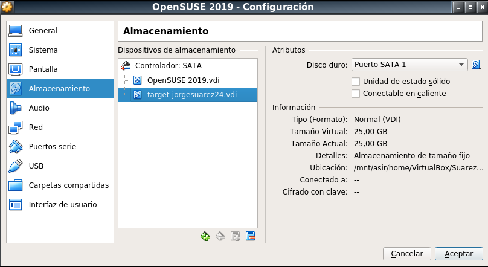

Tras esto descargar la ISO con Clonezilla más reciente.

---

## 3. Inicamos Clonezilla

Iniciar la MV con Clonezilla para realizar una clonación tipo `device-device` haciendo los siguientes pasos:

* Elegimos idioma

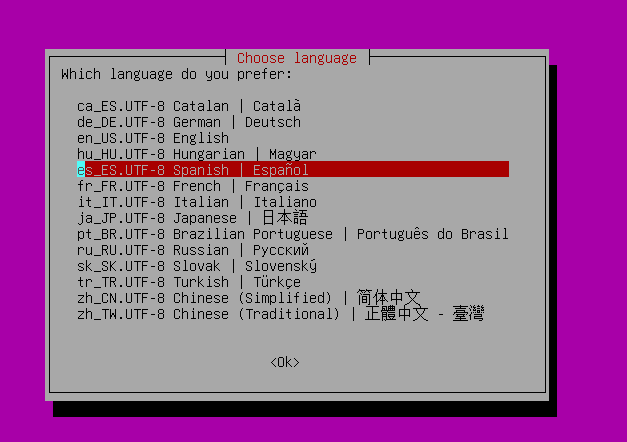

* Elegir el mapa de teclado `qwerty -> Standard -> Standard`

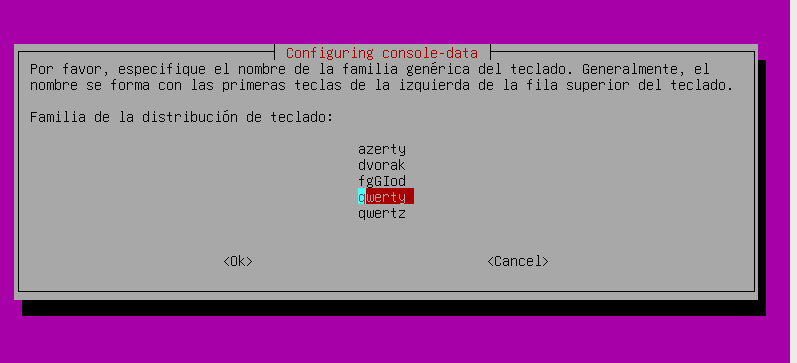

* Iniciar Clonezilla

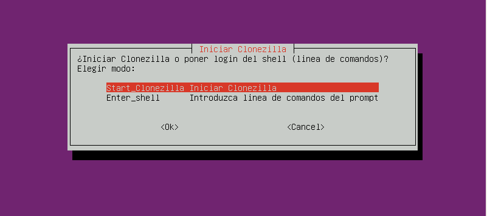

* `device-device`

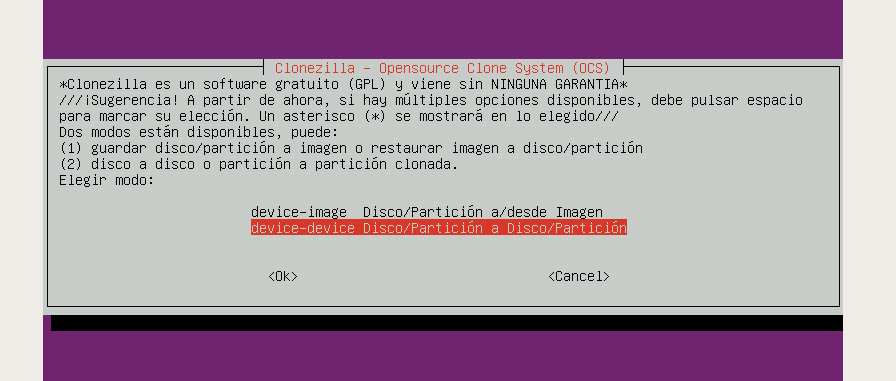

* `Begginer`

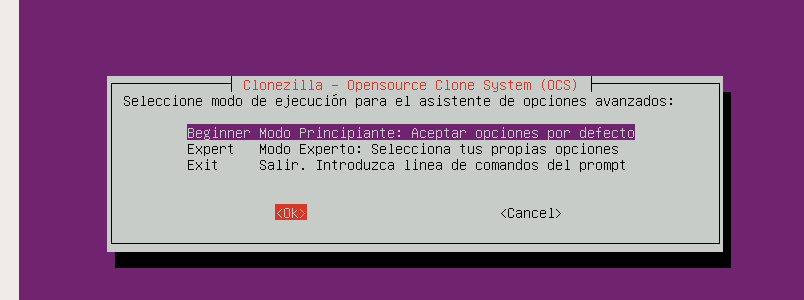

* `disco-local a disco-local`

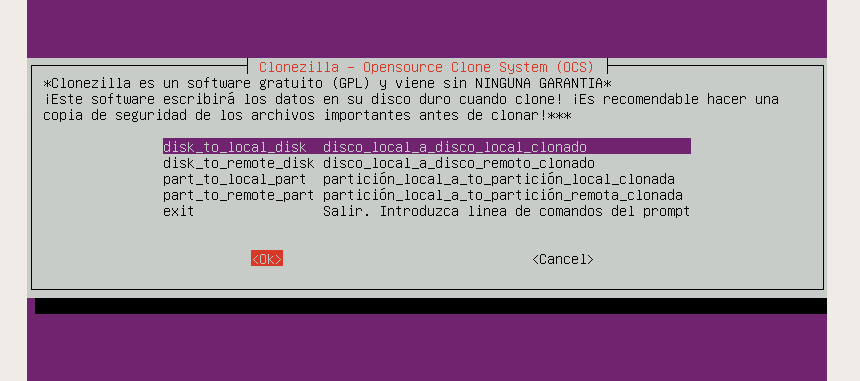

* Elegir disco origen

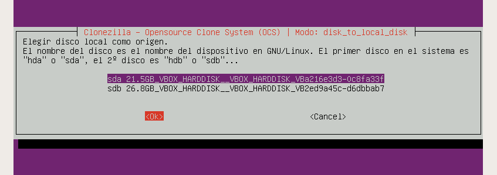

* Elegir disco destino

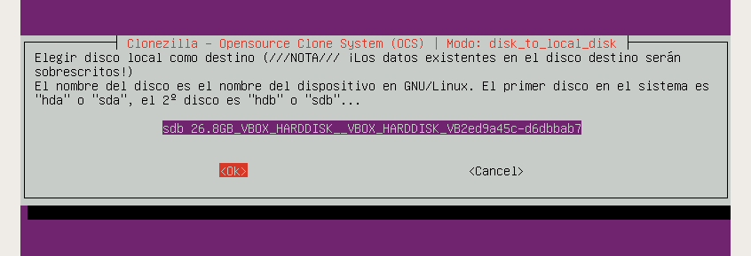

Tendrá que salir una pantalla como la siguiente cuando se esté copiando.

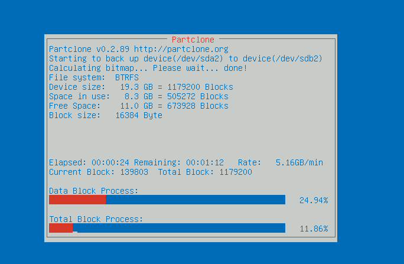

---

## 4. Comprobamos

Quitamos el `disco clonado` y creamos un archivo llamado `/home/jorge/Documentos/disco-original.txt`.

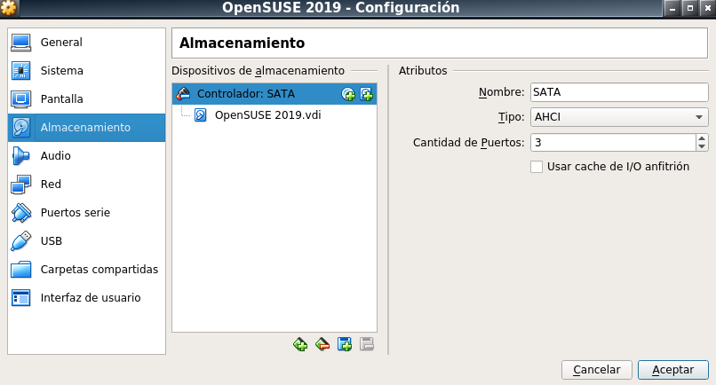

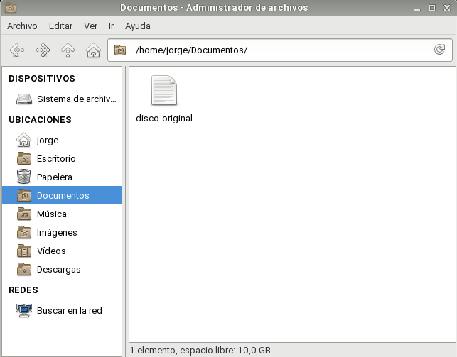

Ahora quitamos el `disco original` y añadimos el `disco clonado`.

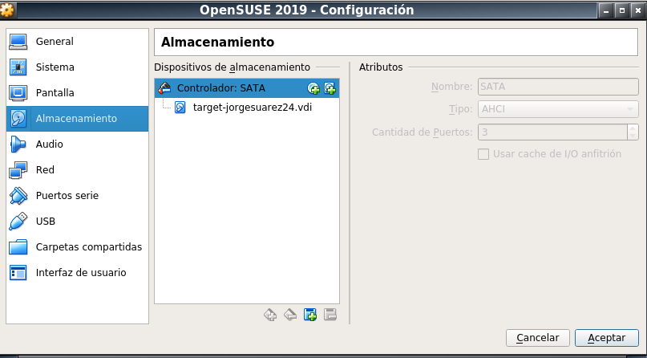

Comprobamos que el fichero no existe

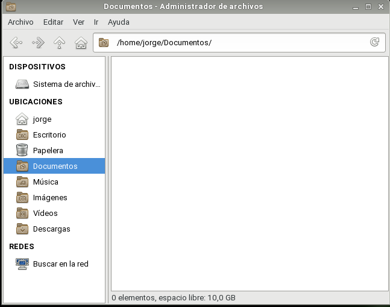
